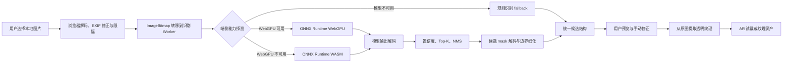
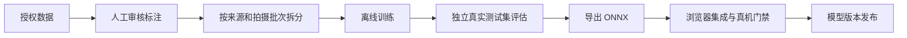

# 手部美甲纹理抠图模型端侧实施技术规范

版本：v1.1
日期：2026-07-11  
状态：实施基线  
适用项目：JiaRu 美甲参考图纹理提取与 AR 试戴

## 1. 文档目的

本文档用于把“用户设备本地完成美甲纹理识别和抠图”的产品想法，落实为可实施、可测试、可验收、可回滚的工程方案。

本文档重点回答以下问题：

1. 端侧方案是否适合普通电脑和主流手机。
2. MVP 应承诺什么，不应承诺什么。
3. 模型训练、浏览器推理、后处理和纹理提取如何衔接。
4. 第一版、Beta 和正式发布分别使用什么验收标准。
5. 用户需要提供什么，工程侧需要完成什么。
6. 什么情况下可以继续、暂缓或回滚模型发布。

## 2. 结论与核心决策

### 2.1 总体结论

方案技术上可行，建议继续实施。

推荐产品形态是：

> 模型在开发机或训练服务器离线训练，导出轻量 ONNX；用户上传的参考图片只在其浏览器内完成解码、推理、mask 后处理和透明纹理提取。

端侧推理本身不是项目的主要风险。更大的风险来自真实数据覆盖不足、训练与浏览器预处理不一致、真实 ONNX 输出协议未闭环，以及反光、遮挡和复杂纹样造成的纹理质量问题。

### 2.2 MVP 边界

MVP 包含：

- 用户上传一张本地参考图。
- 自动识别 1 到 10 个甲面实例。
- 输出每个实例的位置、置信度、方向和二值/软 mask。
- 从原始分辨率图片提取透明背景纹理。
- 允许用户移动、旋转、缩放、删除、补加和分配手指。
- WebGPU 不可用时回退到 WASM。
- 模型加载或推理失败时回退到现有规则识别。
- 图片不因识别和抠图流程被上传到服务器。

MVP 不包含：

- 在用户设备上训练或微调模型。
- 对摄像头每一帧运行完整 640×640 实例分割。
- 对任意图片承诺像素级完美边缘。
- 自动消除全部高光、阴影、透视和甲面曲率。
- 生成新的美甲设计。
- 医疗级或工业检测级指甲分割。

### 2.3 实时 AR 的边界

静态参考图纹理抠图与实时 AR 甲面跟踪是两条不同链路：

- 参考图：允许一次较重但高质量的实例分割。
- 实时 AR：使用手部关键点、低频检测和帧间跟踪，不应每帧运行全图实例分割。

如果未来需要实时分割，应采用“低频重新检测 + 高频关键点/光流跟踪 + 状态平滑”，而不是简单提高完整分割模型调用频率。

## 3. 当前项目基线

### 3.1 已具备能力

仓库目前已经具备以下工程基础：

- Next.js 浏览器应用和本地图片处理 UI。
- `onnxruntime-web` 依赖。
- `NailArtPicker` 自动识别和手动修正入口。
- Worker 客户端、Worker 入口和统一识别服务。
- WebGPU、WASM、规则 fallback 的设计结构。
- 最长边 800 像素的检测输入限幅。
- 规则检测 baseline 和模型失败回退。
- mask 纹理提取、边缘羽化和调试诊断。
- 数据导入、标注转换、拆分、审计、训练、评估和 ONNX 导出脚本。
- 性能门禁、纹理质量门禁、模型发布和回滚工具链。

相关实现：

- `src/components/NailArtPicker.tsx`
- `src/lib/nail-texture-recognition/`
- `src/workers/nail-texture-recognition.worker.ts`
- `model/training/`
- `scripts/verify-recognition-performance.ts`
- `scripts/verify-texture-quality-gate.ts`

### 3.2 当前尚未闭环的事项

当前不能宣称真实模型已经可用，原因包括：

1. `public/models/nail-texture-seg/manifest.json` 指向的真实 ONNX 文件尚不存在。
2. 最新训练流水线报告仍是 `dry-run`，没有真实权重、指标和最终审计产物。
3. Worker 环境没有 `window`，但当前 runtime 以 `typeof window === "undefined"` 判定服务端，因此 Worker 内会直接进入 fallback。
4. ONNX Runtime 使用隐藏于 `new Function()` 的动态导入，存在打包器无法静态收集依赖的风险。
5. 浏览器预处理当前把非方图直接拉伸为方图，与常见 YOLO letterbox 训练流程不一致。
6. 后处理尚未用真实导出模型确认输出维度、转置、置信度、NMS 和 mask coefficients 协议。
7. 当前 mask 解码可能在筛选前处理过多候选，并重复复制 prototype tensor，移动端 CPU 和内存成本偏高。
8. 高光修复启发式可能误伤法式白边、珍珠、银白和低饱和纹样。

### 3.3 当前数据的正确定位

当前数据规模已经达到工具链门槛，但主体为同一来源组的 AI 合成图片，真实域泛化证据不足。

因此现有合成数据应定位为：

- 数据管线和训练脚本验证材料。
- 预训练、增强或消融实验材料。
- 不能单独作为正式发布质量证据。
- 不应进入最终独立真实测试集。

## 4. 总体架构



训练链路与用户推理链路必须隔离：



## 5. 端侧部署策略

### 5.1 浏览器本地推理

浏览器本地推理是当前项目的主路线，原因是它与现有 Next.js、Canvas、ImageBitmap 和 Worker 架构一致，无需先引入桌面或移动原生容器。

执行后端优先级：

1. ONNX Runtime Web + WebGPU。
2. ONNX Runtime Web + WASM。
3. 规则检测 fallback。
4. 用户手动添加和修正区域。

### 5.2 设备分级

| 设备档位 | 推荐后端 | 推荐输入 | 产品策略 |
| --- | --- | ---: | --- |
| 桌面 Chromium，WebGPU 可用 | WebGPU | 512 或 640 | 优先质量，复用 Session |
| 中端 Android Chromium | WebGPU | 384、448 或 512 | 根据首轮基准自动选择 |
| 桌面无 WebGPU | WASM | 384 或 512 | 接受更长等待，保持 UI 可取消 |
| iPhone / Safari | WASM | 384 或 448 起步 | 单独建立真机基线，不承诺与 Android 同速 |
| 极弱设备或运行时失败 | fallback | 规则检测输入 | 提示用户复核并保留手动模式 |

输入尺寸不能只由浏览器名称决定，应结合真实初始化和热推理基准做设备分级。

### 5.3 “本地处理”与“完全离线”的区别

本地处理表示图片不上传，推理发生在用户设备。

完全离线还要求：

- ONNX 模型已缓存或随应用分发。
- WASM 文件本地托管并可离线访问。
- MediaPipe 等第三方资产不依赖 CDN。
- 应用本身具备 PWA/Service Worker 缓存或桌面封装。

第一阶段承诺“图片本地处理”，不默认承诺首次访问即可完全离线。

## 6. 模型方案

### 6.1 MVP 模型

首版使用单类别轻量实例分割模型：

- 类别：`nail_texture`。
- 模型级别：nano 级 segmentation。
- 固定 batch：1。
- 主输入候选：512×512、640×640。
- 弱设备候选：384×384、448×448。
- 输出：box、置信度、mask coefficients、mask prototype。
- ONNX 体积上限：15MB。
- 理想体积：8–12MB。
- 第一版先导出 FP32 基线，再评估 FP16/INT8。

量化不能先于基线准确率验证。只有当 FP32 模型输出协议、准确率和浏览器性能稳定后，才评估量化误差和算子兼容性。

### 6.2 输出协议必须显式版本化

manifest 除现有字段外，建议逐步增加：

```json
{
  "version": "nail-texture-seg-v1",
  "task": "segment",
  "inputSize": 512,
  "inputLayout": "NCHW",
  "colorOrder": "RGB",
  "normalization": "zero_to_one",
  "resizeMode": "letterbox",
  "backendPreferences": ["webgpu", "wasm"],
  "modelFile": "nail-texture-seg-v1.onnx",
  "outputContract": "ultralytics-seg-raw-v1",
  "labels": ["nail_texture"],
  "modelSizeBytes": 0,
  "sha256": ""
}
```

`outputContract` 用于避免模型升级后输出维度变化却继续被旧后处理误读。

### 6.3 后续两阶段路线

如果单阶段模型在弱设备上过慢，或甲面边缘质量不足，可升级为：

1. 全图轻量甲面检测器，输入 384/512。
2. 只对 Top-K 甲面 ROI 运行共享二值 mask refiner，输入 192/256。
3. 在原图尺度进行边缘细化和羽化。

两阶段路线增加工程复杂度，因此不作为第一版前置条件。

## 7. 预处理协议

训练、Python 评估和浏览器推理必须使用同一协议。

### 7.1 图片解码

- 处理 EXIF 方向。
- 将 alpha 与明确的背景策略统一处理。
- 过滤异常尺寸和损坏图片。
- 保留原始宽高，用于最终纹理采样。
- 检测输入最长边继续限制为 800 像素，避免高分辨率 RGBA 缓冲占用过大。

### 7.2 Letterbox

不得把任意横竖图直接拉伸为正方形。

预处理必须返回：

- `originalWidth`、`originalHeight`
- `resizedWidth`、`resizedHeight`
- `scale`
- `padLeft`、`padTop`
- `inputWidth`、`inputHeight`

模型坐标还原顺序：

1. 从模型坐标中去除 padding。
2. 除以 letterbox scale。
3. clamp 到检测输入范围。
4. 再映射到原始图片范围。

### 7.3 Tensor 格式

- 颜色顺序：RGB。
- 数据类型：FP32 基线。
- 数值范围：0 到 1。
- 内存布局：NCHW。
- batch：1。

预处理协议必须通过固定像素 fixture 测试，不仅测试 tensor 长度，还要测试颜色通道、采样位置和坐标逆变换。

## 8. Worker 与运行时设计

### 8.1 环境识别

不能使用“是否存在 `window`”区分浏览器和服务端，因为 Web Worker 本来就没有 `window`。

建议区分：

- 主线程浏览器：存在 `window` 和 `document`。
- Worker 浏览器：存在 `self`、`WorkerGlobalScope` 或 `OffscreenCanvas`，且不存在 `document`。
- Node.js/服务端：不存在浏览器 Worker 所需能力。

### 8.2 ONNX Runtime 加载

目标：让 Next.js 构建器明确收集 ONNX Runtime 和所需 WASM 资产。

要求：

- 避免用 `new Function()` 隐藏包导入。
- WebGPU 与 WASM 使用可被构建器分析的明确入口。
- 确保 WASM 文件的 URL 与部署路径一致。
- WebGPU Session 创建失败后，允许重新创建 WASM Session。
- Session 按“模型版本 + 后端 + 输入尺寸”缓存。
- 切换模型版本或后端时显式释放旧 Session 和 GPU 资源。

### 8.3 Worker 生命周期

- 通过 Transferable 传输 `ImageBitmap`。
- Worker 内复用 Session，不为每张图重新初始化模型。
- 支持取消、超时和组件卸载清理。
- 同一时间限制并发识别数量，避免多张图造成内存峰值叠加。
- Worker 崩溃后能够重建，并把当前请求安全回退到规则识别。

### 8.4 运行时状态

UI 至少显示或记录：

- `backend`: model / fallback
- `executionProvider`: webgpu / wasm
- `modelVersion`
- `coldStartMs`
- `elapsedMs`
- `workerElapsedMs`
- `warnings`

产品界面不必暴露全部调试字段，但调试导出必须保留。

## 9. 模型后处理协议

### 9.1 真实输出契约验证

接入首个真实模型时必须保存：

- 输入名称与维度。
- 每个输出名称与维度。
- 小规模输出 sample。
- 模型版本和导出配置。
- 与 Python 参考推理的结果对照。

不能依靠测试 fixture 猜测真实 YOLO 输出布局。

### 9.2 建议处理顺序

1. 识别输出 tensor 和维度布局。
2. 必要时把通道优先输出转置为候选行。
3. 计算类别置信度。
4. 过滤低置信度候选。
5. 限制预 NMS Top-K。
6. 执行 NMS。
7. 限制最终 1 到 10 个候选。
8. 只为最终候选解码 mask。
9. mask 按候选框裁切。
10. 去除 letterbox padding 并映射回原图。
11. 计算主方向、质量提示和建议手指。

### 9.3 性能约束

- prototype tensor 只转换或读取一次。
- 不为每个候选重复 `Array.from` 整个 prototype。
- 不为被置信度或 NMS 淘汰的候选解码 mask。
- 尽量复用 typed array 和临时缓冲。
- 保留候选数量上限，避免异常图片产生不可控计算量。

### 9.4 mask 质量处理

- mask threshold 必须由真实验证集调参。
- 仅进行轻量孔洞填充、孤立点去除和边缘羽化。
- 形态学操作不能明显吞掉细窄法式边或尖甲轮廓。
- 模型 mask、后处理 mask 和用户修正结果必须能分别记录，以便定位误差来源。

## 10. 透明纹理提取

### 10.1 原图采样

模型只负责在缩小图上定位和分割，最终纹理必须从原始分辨率图片采样，以避免模型输入尺寸限制纹理细节。

提取流程：

1. 将 mask 映射回原图。
2. 计算甲面紧致边界。
3. 按方向旋转到统一朝向。
4. 生成带 alpha 的纹理图。
5. 对边缘进行小半径羽化。
6. 输出 `ImageBitmap` 或等价浏览器纹理资产。

### 10.2 高光处理

高光修复属于纹理恢复，不属于基础分割，必须独立控制。

要求：

- MVP 默认保留原始高光。
- 高光修复作为可关闭的增强选项。
- 白色法式边、珍珠、银白、镜面和低饱和设计必须加入专项测试。
- 高光修复前后分别保留诊断结果，不能不可逆覆盖唯一纹理资产。

### 10.3 透视与曲率展开

首版可以只做旋转和紧致裁剪。

当真实测试表明甲面透视导致 AR 纹理明显变形时，再引入四点透视或 TPS 展平。该能力应通过产品可用率证明必要性，而不是提前增加模型复杂度。

## 11. 数据方案

### 11.1 数据角色

| 数据类型 | 主要用途 | 是否可进入正式 test |
| --- | --- | --- |
| AI 合成图 | 工具链验证、预训练、增强 | 否 |
| 授权真实参考图 | 训练和验证 | 可以，但必须按来源分组 |
| 授权真实用户图 | 贴近真实上传分布 | 可以，优先保留独立测试子集 |
| 负样本 | 降低饰品、花瓣、皮肤纹理误检 | 可以 |
| 历史失败案例 | 主动学习和回归测试 | 可以，必须避免泄漏到训练集 |

### 11.2 真实数据覆盖

真实数据至少覆盖：

- 不同肤色、手型和年龄段外观。
- 裸甲、透明甲、浅色甲、深色甲和黑色甲。
- 法式边、猫眼、亮片、珍珠、镜面、渐变和复杂图案。
- 圆甲、方甲、尖甲、长甲、短甲和人工甲片。
- 单甲、单手、双手、甲片板和商家样板图。
- 横图、竖图、方图和不同分辨率。
- 远景、近景、裁切不完整、运动模糊和低照度。
- 戒指、饰品、手指互相遮挡和复杂背景。
- 无美甲图片、花瓣、珠宝、印刷纹理等 hard negative。

### 11.3 数据规模是阶段性目标

数量不是质量保证，以下范围仅用于安排工作量：

| 阶段 | 真实正样本建议 | 负样本建议 | 独立真实测试集 | 目的 |
| --- | ---: | ---: | ---: | --- |
| 工程冒烟 | 0–50 | 0–20 | 固定少量案例 | 验证链路，不判断泛化 |
| 模型试验 | 100–200 | 约 100 | 至少 30–50 | 判断是否能学习真实域 |
| Beta | 300–500 | 至少 200 | 至少 100 | 调优准确率与产品体验 |
| 正式发布 | 500–1000+ | 200–500 | 100–200+ | 建立代表性发布证据 |

如果样本高度重复，即使数量达标也不能通过 readiness gate。

### 11.4 数据拆分

必须按以下信息分组拆分：

- 用户或来源。
- 拍摄 session。
- 连拍批次。
- 同一商家或同一套图。
- AI 生成批次。

同一组不得跨 train、val、test。近似重复图必须在拆分前检测和归组。

### 11.5 标注与授权

- 每张图片保留来源、许可、授权范围和创建时间。
- 用户图片只有在明确授权后才进入训练数据。
- mask 必须贴合真实甲面，不使用固定模板替代人工复核。
- 记录遮挡、人工甲片、甲面形状、质量等级和失败原因。
- 标注审计 error 必须为零；warning 必须人工确认后才能用于正式训练。

## 12. 评测指标与明确口径

### 12.1 模型指标

- box mAP50。
- mask mAP50。
- AP75 和 mAP50:95。
- Dice / IoU。
- Boundary-F1。
- 每图漏检率。
- 每图误检数和 hard negative 误检率。
- 方向角误差。

### 12.2 产品指标

#### 直接可用率

定义：候选纹理无需移动 mask、补边或删除背景，即可被审核者接受用于 AR 试戴的实例比例。

必须明确：

- 纯粹调整手指分配是否仍算直接可用。
- 轻微旋转是否算直接可用。
- 由几名审核者判断以及分歧如何处理。

建议正式口径：不修改甲面几何和 alpha 边缘即可使用；仅改变手指分配不视为抠图失败。

#### 背景/皮肤泄漏率

建议按实例计算：

```text
leakageRate = predictedMask 中位于 GT 甲面外的面积 / predictedMask 总面积
```

#### 甲面缺失率

```text
missingRate = GT 甲面中未被 predictedMask 覆盖的面积 / GT 甲面总面积
```

泄漏率和缺失率必须分别报告，避免通过缩小 mask 人为降低污染率。

#### 人工修正成本

- 需要修正的实例比例。
- 每张图平均修正时间。
- 删除、补加、移动、旋转和修边的操作次数。

### 12.3 分组指标

总体平均值不能掩盖特定人群或场景失败。至少按以下维度报告：

- 肤色区间。
- 甲色深浅。
- 反光/非反光。
- 遮挡/无遮挡。
- 横图/竖图。
- 单甲/多甲/甲片板。
- 简单背景/复杂背景。
- 目标设备和执行后端。

## 13. 性能测量口径

### 13.1 冷启动

冷启动单独统计：

- 模型下载或缓存读取。
- WASM 资产加载。
- WebGPU adapter/device 初始化。
- ONNX Session 创建与图优化。

冷启动可以超过热推理预算，但必须显示明确加载状态，并避免重复发生。

### 13.2 热推理端到端时间

热推理从用户图片已经解码后开始，覆盖：

1. 检测图缩放和像素准备。
2. `createImageBitmap`。
3. Worker 排队与传输。
4. tensor 预处理。
5. ONNX 推理。
6. NMS 和 mask 后处理。
7. 候选返回主线程。

正式报告使用 P50、P95 和最大值，不只使用单次平均值。

### 13.3 建议性能门槛

| 配置 | 阶段 | 门槛 |
| --- | --- | ---: |
| 桌面 Chromium + WebGPU | Beta/正式，热推理端到端 P95 | <800ms |
| 中端 Android + WebGPU | Beta/正式，热推理端到端 P95 | <1500ms |
| 桌面 WASM | 首轮先建立基线 | 基线后冻结门槛 |
| iPhone / Safari WASM | 首轮先建立基线 | 不直接套用 Android 门槛 |

移动端正式门槛必须绑定具体设备档位、浏览器版本、输入尺寸和模型版本。

### 13.4 内存与稳定性

- ONNX 文件 <15MB，理想 8–12MB。
- 移动端识别链路增量峰值内存建议控制在 128–150MiB 以内。
- 连续运行至少 20 次后，内存不能持续单调增长。
- Worker 取消或崩溃后必须释放 `ImageBitmap` 和临时缓冲。
- 同一时刻默认只运行一个识别请求。

内存门槛需要通过真机基准确认，不能只根据 tensor 理论体积推断。

## 14. 分阶段验收标准

### 14.1 阶段 A：工程冒烟版

目标：证明浏览器确实在本地运行真实 ONNX，而不是继续使用 fallback。

必须通过：

- Worker 可识别浏览器 Worker 环境。
- ONNX Runtime 能被构建并加载。
- WebGPU 或 WASM Session 创建成功。
- UI 显示真实模型版本和执行后端。
- 模型失败后 fallback 正常。
- 取消和超时正常。
- 横图、竖图和方图坐标逆变换正确。
- 至少一个真实 ONNX 输出 fixture 进入自动测试。

本阶段不设置 mAP 和直接可用率门槛。

### 14.2 阶段 B：模型试验版

目标：证明轻量模型可以从真实数据中学习甲面分割。

建议门槛：

- mask mAP50 ≥0.65。
- box mAP50 ≥0.75。
- 直接可用率 ≥60%。
- ONNX <15MB。
- 独立测试集没有来源或近似重复泄漏。
- 能形成可解释的失败类型清单。

该门槛用于决定是否继续扩充数据和优化模型，不代表可正式发布。

### 14.3 阶段 C：Beta

目标：在受控用户范围内验证真实产品体验。

建议门槛：

- mask mAP50 ≥0.75。
- box mAP50 ≥0.85。
- 直接可用率 ≥80%。
- 桌面 WebGPU 热推理 P95 <800ms。
- 中端 Android WebGPU 热推理 P95 <1500ms。
- fallback、手动修正和取消能力完整。
- 真实失败样本能够进入授权复核流程。

### 14.4 阶段 D：正式发布

必须通过：

- 直接可用率 ≥85%。
- 明显皮肤/背景污染实例比例 <10%，并同时报告像素级泄漏率。
- 粗糙矩形化实例比例 ≤15%。
- 甲面缺失率达到冻结后的发布门槛。
- 至少 100–200 个独立真实测试图片形成发布证据。
- 主要场景分组没有不可接受的明显退化。
- 目标设备性能、峰值内存和连续运行稳定性通过。
- 模型 manifest、大小、SHA256、指标和发布记录完整。
- 可一键切回上一已批准模型。

## 15. 测试策略

### 15.1 单元测试

- Letterbox 和坐标逆变换。
- RGB/NCHW tensor 生成。
- 输出布局识别和转置。
- 置信度过滤、Top-K 和 NMS。
- mask coefficients × prototype 解码。
- box crop、padding 去除和原图映射。
- 方向估计和候选排序。
- 泄漏率、缺失率和直接可用率统计。

### 15.2 真实输出 fixture 测试

每个支持的 `outputContract` 至少保存一个真实模型输出 dump，并验证：

- 输出名称和维度。
- 候选数量。
- 至少一个候选坐标。
- mask 前景像素范围。
- 与 Python 参考后处理的一致性。

### 15.3 浏览器集成测试

- WebGPU 成功路径。
- WebGPU 失败转 WASM。
- ONNX 加载失败转 fallback。
- Worker 不可用转主线程或 fallback。
- 超时、取消、组件卸载和重复上传。
- 图片全程无识别上传请求。

### 15.4 视觉回归

固定真实样本覆盖：

- 横图和竖图。
- 深色、浅色、透明和镜面甲。
- 法式边和细线图案。
- 复杂背景和遮挡。
- 单甲、五甲和甲片板。

每次候选模型发布都生成 overlay、mask 和透明纹理对照图。

### 15.5 性能测试

- 冷启动与热推理分开。
- WebGPU 与 WASM 分开。
- 输入尺寸分开。
- 桌面、Android 和 iPhone 分开。
- 至少多次运行后计算 P50/P95。
- 同时报告 Worker 时间、主线程开销和峰值内存。

## 16. 执行清单与职责

### 16.1 用户需要完成

- [x] 确认 MVP 首先只做单张上传图片的纹理抠图。
- [x] 指定优先目标设备和最低设备档位。
- [x] 提供首批 50–100 张真实参考图。
- [x] 明确图片是否允许用于内部训练、商业发布训练和回归测试。（首批 22 张、300 张 AI 图和新增 113 张均已确认）
- [ ] 提供实际用户可能上传的典型失败案例。
- [ ] 在 Beta 阶段参与“直接可用/需要修正/不可用”审核。

### 16.2 工程侧需要完成

- [x] 修复 Worker 环境判断和 ONNX Runtime 加载。
- [x] 接入真实 ONNX 冒烟模型。
- [x] 固定并版本化模型输入输出协议。
- [x] 实现 letterbox 和精确坐标还原。
- [x] 实现真实输出转置、Top-K、NMS 和按框 mask 解码。
- [x] 优化 prototype 和 typed array 内存使用。
- [x] 建立真实输出 fixture 与 Python 对照测试。
- [ ] 完善真实数据来源、授权、分组拆分和人工复核。（新增批次授权与78张/507 mask导入已完成，4张源图因甲面截断/失焦排除，31张待返修；独立真实test已冻结13张，仍需扩充至100–200张代表性样本）
- [x] 训练 FP32 基线并评估输入尺寸。
- [x] 评估量化，但不牺牲纹理细边缘。（INT8 候选经门禁拒绝，FP32 保持默认）
- [ ] 建立真实设备性能和内存报告。（v6 桌面 Chromium WebGPU 29 次热推理 P95=133.7ms、20 次内存稳定性门已通过；Android/iPhone/iPad 真机矩阵与移动端峰值内存等待执行）
- [x] 将质量、性能和模型资产门禁接入发布决策。
- [x] 保持 fallback、手动修正和回滚能力。

## 17. 推荐执行顺序

### 里程碑 1：真实模型端侧冒烟

1. 修复 Worker runtime。
2. 使用构建器可分析的 ONNX Runtime 导入。
3. 接入一个真实 ONNX。
4. 保存真实输出 dump。
5. UI 显示 `model / webgpu` 或 `model / wasm`。
6. 验证 fallback、取消和超时。

完成定义：浏览器确实完成真实模型推理，不再把规则识别结果误认为模型结果。

### 里程碑 2：正确后处理与真实数据试验

1. 统一训练和浏览器 letterbox。
2. 对齐 Python 与 TypeScript 后处理。
3. 增加 Top-K、NMS、mask crop 和坐标还原。
4. 导入首批授权真实图片。
5. 建立独立真实测试集。
6. 训练模型试验版。

完成定义：模型在没有数据泄漏的真实测试集上达到阶段 B 门槛。

### 里程碑 3：Beta 和设备验收

1. 扩充真实数据与 hard negative。
2. 优化模型、后处理和纹理提取。
3. 建立桌面、Android 和 iPhone 基准。
4. 统计直接可用率、污染率和修正成本。
5. 通过 Beta 发布门禁。

完成定义：受控用户可以稳定完成参考图纹理提取，失败时能够快速修正或回退。

## 18. 风险与应对

| 风险 | 影响 | 应对 |
| --- | --- | --- |
| 合成数据与真实图片域差异 | 测试漂亮但真实失败 | 合成图不进入正式 test，优先补真实授权数据 |
| 同来源数据跨 split | 指标虚高 | 按用户、来源、session 和近似重复分组拆分 |
| 浏览器预处理与训练不一致 | 坐标和准确率异常 | 固定 letterbox、归一化和颜色协议，并做 fixture |
| 模型输出布局变化 | 候选被错误解析 | manifest 增加 `outputContract` 并保存真实 dump |
| mask 解码内存过高 | 手机卡顿或崩溃 | 先 Top-K/NMS，再解码最终 mask，复用缓冲 |
| WebGPU 不可用或算子不兼容 | 模型初始化失败 | WebGPU → WASM → 规则 fallback |
| 高光修复破坏白色纹样 | 纹理语义丢失 | 默认关闭，作为独立增强并专项评测 |
| 透明甲和肤色接近 | 边缘泄漏或缺失 | 增加真实困难样本、Boundary-F1 和泄漏/缺失指标 |
| 弱手机性能不足 | 等待过长 | 动态降到 384/448、限制并发、保留手动模式 |
| 用户图片隐私 | 产品信任风险 | 默认不上传；训练回流必须显式授权 |
| 模型升级回归 | 已有场景变差 | 固定真实回归集、版本登记和一键回滚 |

## 19. 发布决策

### Go

满足当前阶段全部硬门槛，且没有真实测试集泄漏、隐私问题或不可接受的设备崩溃。

### Hold

出现以下任一情况时暂停 promotion：

- 指标通过但真实直接可用率不足。
- 真实模型仅在 fallback 下显示成功。
- 性能样本不足或目标设备缺少报告。
- 模型输出协议与后处理实现未锁定。
- 数据来源或训练授权不完整。
- 某一重要场景分组明显退化。

### No-Go / 回滚

- 用户图片被非预期上传。
- 模型导致页面崩溃或持续内存增长。
- 发布模型无法在目标后端初始化，且 fallback 也失效。
- 新模型对固定真实回归集产生重大质量退化。
- 模型文件、manifest、SHA256 或发布记录不一致。

## 20. 与现有文档的关系

本文档定义端侧实施总规范，具体操作继续复用以下文档：

- `docs/nail-texture-recognition-model-plan.md`：专用模型总体规划。
- `docs/real-model-integration-checklist.md`：真实 ONNX 接入操作清单。
- `docs/recognition-performance-gate.md`：端到端性能门禁。
- `docs/texture-quality-gate.md`：直接可用率、污染率和形状保真门禁。
- `docs/phase1-readiness-gate.md`：训练数据 readiness。
- `docs/training-release-pipeline.md`：训练、评估和导出流水线。
- `docs/model-release-registry.md`：模型版本登记。
- `docs/release-governance-pipeline.md`：发布决策、promotion 和回滚。

## 21. 外部技术参考

- ONNX Runtime Web：<https://onnxruntime.ai/docs/get-started/with-javascript/web.html>
- ONNX Runtime WebGPU：<https://onnxruntime.ai/docs/tutorials/web/ep-webgpu.html>
- ONNX Runtime Web 部署：<https://onnxruntime.ai/docs/tutorials/web/deploy.html>
- Ultralytics segmentation：<https://docs.ultralytics.com/tasks/segment/>
- Ultralytics export：<https://docs.ultralytics.com/modes/export/>
- WebGPU API：<https://developer.mozilla.org/en-US/docs/Web/API/WebGPU_API>

## 22. 最终落地判断

本方案不是依赖高端显卡才能成立的重型方案。对于“单张图片、单次识别、nano 级模型、输入限幅、Worker 推理、WebGPU/WASM 分级和规则 fallback”的产品边界，它可以适配普通电脑和主流手机。

正式落地的关键不是继续增加模型复杂度，而是依次完成：

1. 真实 ONNX 端侧闭环。
2. 训练与浏览器输入输出协议一致。
3. 真实授权数据和无泄漏测试集。
4. 产品可用率与真实设备性能门禁。
5. fallback、手动修正、版本管理和回滚。

只有当上述证据完整时，才能从“技术上可行”升级为“可正式发布”。
