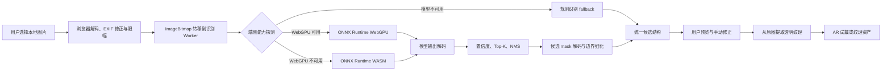
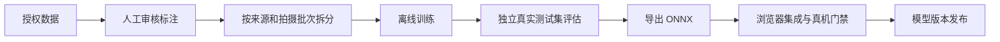

# 手部美甲纹理抠图模型端侧实施技术规范

版本：v1.1
日期：2026-07-11  
状态：实施基线  
适用项目：JiaRu 美甲参考图纹理提取与 AR 试戴

## 1. 文档目的

本文档用于把“用户设备本地完成美甲纹理识别和抠图”的产品想法，落实为可实施、可测试、可验收、可回滚的工程方案。

本文档重点回答以下问题：

1. 端侧方案是否适合普通电脑和主流手机。
2. MVP 应承诺什么，不应承诺什么。
3. 模型训练、浏览器推理、后处理和纹理提取如何衔接。
4. 第一版、Beta 和正式发布分别使用什么验收标准。
5. 用户需要提供什么，工程侧需要完成什么。
6. 什么情况下可以继续、暂缓或回滚模型发布。

## 2. 结论与核心决策

### 2.1 总体结论

方案技术上可行，建议继续实施。

推荐产品形态是：

> 模型在开发机或训练服务器离线训练，导出轻量 ONNX；用户上传的参考图片只在其浏览器内完成解码、推理、mask 后处理和透明纹理提取。

端侧推理本身不是项目的主要风险。更大的风险来自真实数据覆盖不足、训练与浏览器预处理不一致、真实 ONNX 输出协议未闭环，以及反光、遮挡和复杂纹样造成的纹理质量问题。

### 2.2 MVP 边界

MVP 包含：

- 用户上传一张本地参考图。
- 自动识别 1 到 10 个甲面实例。
- 输出每个实例的位置、置信度、方向和二值/软 mask。
- 从原始分辨率图片提取透明背景纹理。
- 允许用户移动、旋转、缩放、删除、补加和分配手指。
- WebGPU 不可用时回退到 WASM。
- 模型加载或推理失败时回退到现有规则识别。
- 图片不因识别和抠图流程被上传到服务器。

MVP 不包含：

- 在用户设备上训练或微调模型。
- 对摄像头每一帧运行完整 640×640 实例分割。
- 对任意图片承诺像素级完美边缘。
- 自动消除全部高光、阴影、透视和甲面曲率。
- 生成新的美甲设计。
- 医疗级或工业检测级指甲分割。

### 2.3 实时 AR 的边界

静态参考图纹理抠图与实时 AR 甲面跟踪是两条不同链路：

- 参考图：允许一次较重但高质量的实例分割。
- 实时 AR：使用手部关键点、低频检测和帧间跟踪，不应每帧运行全图实例分割。

如果未来需要实时分割，应采用“低频重新检测 + 高频关键点/光流跟踪 + 状态平滑”，而不是简单提高完整分割模型调用频率。

## 3. 当前项目基线

### 3.1 已具备能力

仓库目前已经具备以下工程基础：

- Next.js 浏览器应用和本地图片处理 UI。
- `onnxruntime-web` 依赖。
- `NailArtPicker` 自动识别和手动修正入口。
- Worker 客户端、Worker 入口和统一识别服务。
- WebGPU、WASM、规则 fallback 的设计结构。
- 最长边 800 像素的检测输入限幅。
- 规则检测 baseline 和模型失败回退。
- mask 纹理提取、边缘羽化和调试诊断。
- 数据导入、标注转换、拆分、审计、训练、评估和 ONNX 导出脚本。
- 性能门禁、纹理质量门禁、模型发布和回滚工具链。

相关实现：

- `src/components/NailArtPicker.tsx`
- `src/lib/nail-texture-recognition/`
- `src/workers/nail-texture-recognition.worker.ts`
- `model/training/`
- `scripts/verify-recognition-performance.ts`
- `scripts/verify-texture-quality-gate.ts`

### 3.2 当前尚未闭环的事项

当前不能宣称真实模型已经可用，原因包括：

1. `public/models/nail-texture-seg/manifest.json` 指向的真实 ONNX 文件尚不存在。
2. 最新训练流水线报告仍是 `dry-run`，没有真实权重、指标和最终审计产物。
3. Worker 环境没有 `window`，但当前 runtime 以 `typeof window === "undefined"` 判定服务端，因此 Worker 内会直接进入 fallback。
4. ONNX Runtime 使用隐藏于 `new Function()` 的动态导入，存在打包器无法静态收集依赖的风险。
5. 浏览器预处理当前把非方图直接拉伸为方图，与常见 YOLO letterbox 训练流程不一致。
6. 后处理尚未用真实导出模型确认输出维度、转置、置信度、NMS 和 mask coefficients 协议。
7. 当前 mask 解码可能在筛选前处理过多候选，并重复复制 prototype tensor，移动端 CPU 和内存成本偏高。
8. 高光修复启发式可能误伤法式白边、珍珠、银白和低饱和纹样。

### 3.3 当前数据的正确定位

当前数据规模已经达到工具链门槛，但主体为同一来源组的 AI 合成图片，真实域泛化证据不足。

因此现有合成数据应定位为：

- 数据管线和训练脚本验证材料。
- 预训练、增强或消融实验材料。
- 不能单独作为正式发布质量证据。
- 不应进入最终独立真实测试集。

## 4. 总体架构



训练链路与用户推理链路必须隔离：



## 5. 端侧部署策略

### 5.1 浏览器本地推理

浏览器本地推理是当前项目的主路线，原因是它与现有 Next.js、Canvas、ImageBitmap 和 Worker 架构一致，无需先引入桌面或移动原生容器。

执行后端优先级：

1. ONNX Runtime Web + WebGPU。
2. ONNX Runtime Web + WASM。
3. 规则检测 fallback。
4. 用户手动添加和修正区域。

### 5.2 设备分级

| 设备档位 | 推荐后端 | 推荐输入 | 产品策略 |
| --- | --- | ---: | --- |
| 桌面 Chromium，WebGPU 可用 | WebGPU | 512 或 640 | 优先质量，复用 Session |
| 中端 Android Chromium | WebGPU | 384、448 或 512 | 根据首轮基准自动选择 |
| 桌面无 WebGPU | WASM | 384 或 512 | 接受更长等待，保持 UI 可取消 |
| iPhone / Safari | WASM | 384 或 448 起步 | 单独建立真机基线，不承诺与 Android 同速 |
| 极弱设备或运行时失败 | fallback | 规则检测输入 | 提示用户复核并保留手动模式 |

输入尺寸不能只由浏览器名称决定，应结合真实初始化和热推理基准做设备分级。

### 5.3 “本地处理”与“完全离线”的区别

本地处理表示图片不上传，推理发生在用户设备。

完全离线还要求：

- ONNX 模型已缓存或随应用分发。
- WASM 文件本地托管并可离线访问。
- MediaPipe 等第三方资产不依赖 CDN。
- 应用本身具备 PWA/Service Worker 缓存或桌面封装。

第一阶段承诺“图片本地处理”，不默认承诺首次访问即可完全离线。

## 6. 模型方案

### 6.1 MVP 模型

首版使用单类别轻量实例分割模型：

- 类别：`nail_texture`。
- 模型级别：nano 级 segmentation。
- 固定 batch：1。
- 主输入候选：512×512、640×640。
- 弱设备候选：384×384、448×448。
- 输出：box、置信度、mask coefficients、mask prototype。
- ONNX 体积上限：15MB。
- 理想体积：8–12MB。
- 第一版先导出 FP32 基线，再评估 FP16/INT8。

量化不能先于基线准确率验证。只有当 FP32 模型输出协议、准确率和浏览器性能稳定后，才评估量化误差和算子兼容性。

### 6.2 输出协议必须显式版本化

manifest 除现有字段外，建议逐步增加：

```json
{
  "version": "nail-texture-seg-v1",
  "task": "segment",
  "inputSize": 512,
  "inputLayout": "NCHW",
  "colorOrder": "RGB",
  "normalization": "zero_to_one",
  "resizeMode": "letterbox",
  "backendPreferences": ["webgpu", "wasm"],
  "modelFile": "nail-texture-seg-v1.onnx",
  "outputContract": "ultralytics-seg-raw-v1",
  "scoreThreshold": 0.35,
  "labels": ["nail_texture"],
  "modelSizeBytes": 0,
  "sha256": ""
}
```

`outputContract` 用于避免模型升级后输出维度变化却继续被旧后处理误读。

`scoreThreshold` 是模型版本自身在独立真实验证集上校准的候选置信度阈值，必须是 `0 < value < 1` 的有限数。旧 manifest 缺省时继续使用 `0.35`；不得因单次阈值扫描直接修改共享默认值，候选模型还必须通过误检、候选数量、直接可用率和 Beta 门禁。

阈值校准必须只读取来源隔离的 `val` split，并绑定数据集、来源报告、模型权重、评估指标和预测制品哈希；`test`、冻结发布测试及其派生物一律不得用于选阈值。正式校准证据至少需要30张验证图、零无效真值polygon，并且全部验证图通过原分辨率完整甲面审核；校准器必须读取审核报告，校验dataset路径/哈希、逐标签SHA-256、审核覆盖数以及pass/rework/exclude计数，未提供或被拒绝的审核只能生成诊断结果。任一图片仍需返修/排除或存在漏甲、误标、重复、污染、裁断和未声明交叠时，整套split不得用于模型选择或阈值校准。真值合格后还须满足召回、每图误检和单图候选数门槛；条件不足时只能输出诊断点，`manifestScoreThreshold`必须为空。

### 6.3 后续两阶段路线

如果单阶段模型在弱设备上过慢，或甲面边缘质量不足，可升级为：

1. 全图轻量甲面检测器，输入 384/512。
2. 只对 Top-K 甲面 ROI 运行共享二值 mask refiner，输入 192/256。
3. 在原图尺度进行边缘细化和羽化。

两阶段路线增加工程复杂度，因此不作为第一版前置条件。

## 7. 预处理协议

训练、Python 评估和浏览器推理必须使用同一协议。

### 7.1 图片解码

- 处理 EXIF 方向。
- 将 alpha 与明确的背景策略统一处理。
- 过滤异常尺寸和损坏图片。
- 保留原始宽高，用于最终纹理采样。
- 检测输入最长边继续限制为 800 像素，避免高分辨率 RGBA 缓冲占用过大。

### 7.2 Letterbox

不得把任意横竖图直接拉伸为正方形。

预处理必须返回：

- `originalWidth`、`originalHeight`
- `resizedWidth`、`resizedHeight`
- `scale`
- `padLeft`、`padTop`
- `inputWidth`、`inputHeight`

模型坐标还原顺序：

1. 从模型坐标中去除 padding。
2. 除以 letterbox scale。
3. clamp 到检测输入范围。
4. 再映射到原始图片范围。

### 7.3 Tensor 格式

- 颜色顺序：RGB。
- 数据类型：FP32 基线。
- 数值范围：0 到 1。
- 内存布局：NCHW。
- batch：1。

预处理协议必须通过固定像素 fixture 测试，不仅测试 tensor 长度，还要测试颜色通道、采样位置和坐标逆变换。

## 8. Worker 与运行时设计

### 8.1 环境识别

不能使用“是否存在 `window`”区分浏览器和服务端，因为 Web Worker 本来就没有 `window`。

建议区分：

- 主线程浏览器：存在 `window` 和 `document`。
- Worker 浏览器：存在 `self`、`WorkerGlobalScope` 或 `OffscreenCanvas`，且不存在 `document`。
- Node.js/服务端：不存在浏览器 Worker 所需能力。

### 8.2 ONNX Runtime 加载

目标：让 Next.js 构建器明确收集 ONNX Runtime 和所需 WASM 资产。

要求：

- 避免用 `new Function()` 隐藏包导入。
- WebGPU 与 WASM 使用可被构建器分析的明确入口。
- 确保 WASM 文件的 URL 与部署路径一致。
- WebGPU Session 创建失败后，允许重新创建 WASM Session。
- Session 按“模型版本 + 后端 + 输入尺寸”缓存。
- 切换模型版本或后端时显式释放旧 Session 和 GPU 资源。

### 8.3 Worker 生命周期

- 通过 Transferable 传输 `ImageBitmap`。
- Worker 内复用 Session，不为每张图重新初始化模型。
- 支持取消、超时和组件卸载清理。
- 同一时间限制并发识别数量，避免多张图造成内存峰值叠加。
- Worker 崩溃后能够重建，并把当前请求安全回退到规则识别。

### 8.4 运行时状态

UI 至少显示或记录：

- `backend`: model / fallback
- `executionProvider`: webgpu / wasm
- `modelVersion`
- `coldStartMs`
- `elapsedMs`
- `workerElapsedMs`
- `warnings`

产品界面不必暴露全部调试字段，但调试导出必须保留。

## 9. 模型后处理协议

### 9.1 真实输出契约验证

接入首个真实模型时必须保存：

- 输入名称与维度。
- 每个输出名称与维度。
- 小规模输出 sample。
- 模型版本和导出配置。
- 与 Python 参考推理的结果对照。

不能依靠测试 fixture 猜测真实 YOLO 输出布局。

### 9.2 建议处理顺序

1. 识别输出 tensor 和维度布局。
2. 必要时把通道优先输出转置为候选行。
3. 计算类别置信度。
4. 过滤低置信度候选。
5. 限制预 NMS Top-K。
6. 执行 NMS。
7. 限制最终 1 到 10 个候选。
8. 只为最终候选解码 mask。
9. mask 按候选框裁切。
10. 去除 letterbox padding 并映射回原图。
11. 计算主方向、质量提示和建议手指。

### 9.3 性能约束

- prototype tensor 只转换或读取一次。
- 不为每个候选重复 `Array.from` 整个 prototype。
- 不为被置信度或 NMS 淘汰的候选解码 mask。
- 尽量复用 typed array 和临时缓冲。
- 保留候选数量上限，避免异常图片产生不可控计算量。

### 9.4 mask 质量处理

- mask threshold 必须由真实验证集调参。
- 仅进行轻量孔洞填充、孤立点去除和边缘羽化。
- 形态学操作不能明显吞掉细窄法式边或尖甲轮廓。
- 模型 mask、后处理 mask 和用户修正结果必须能分别记录，以便定位误差来源。

## 10. 透明纹理提取

### 10.1 原图采样

模型只负责在缩小图上定位和分割，最终纹理必须从原始分辨率图片采样，以避免模型输入尺寸限制纹理细节。

提取流程：

1. 将 mask 映射回原图。
2. 计算甲面紧致边界。
3. 按方向旋转到统一朝向。
4. 生成带 alpha 的纹理图。
5. 对边缘进行小半径羽化。
6. 输出 `ImageBitmap` 或等价浏览器纹理资产。

### 10.2 高光处理

高光修复属于纹理恢复，不属于基础分割，必须独立控制。

要求：

- MVP 默认保留原始高光。
- 高光修复作为可关闭的增强选项。
- 白色法式边、珍珠、银白、镜面和低饱和设计必须加入专项测试。
- 高光修复前后分别保留诊断结果，不能不可逆覆盖唯一纹理资产。

### 10.3 透视与曲率展开

首版可以只做旋转和紧致裁剪。

当真实测试表明甲面透视导致 AR 纹理明显变形时，再引入四点透视或 TPS 展平。该能力应通过产品可用率证明必要性，而不是提前增加模型复杂度。

## 11. 数据方案

### 11.1 数据角色

| 数据类型 | 主要用途 | 是否可进入正式 test |
| --- | --- | --- |
| AI 合成图 | 工具链验证、预训练、增强 | 否 |
| 授权真实参考图 | 训练和验证 | 可以，但必须按来源分组 |
| 授权真实用户图 | 贴近真实上传分布 | 可以，优先保留独立测试子集 |
| 负样本 | 降低饰品、花瓣、皮肤纹理误检 | 可以 |
| 历史失败案例 | 主动学习和回归测试 | 可以，必须避免泄漏到训练集 |

### 11.2 真实数据覆盖

真实数据至少覆盖：

- 不同肤色、手型和年龄段外观。
- 裸甲、透明甲、浅色甲、深色甲和黑色甲。
- 法式边、猫眼、亮片、珍珠、镜面、渐变和复杂图案。
- 圆甲、方甲、尖甲、长甲、短甲和人工甲片。
- 单甲、单手、双手、甲片板和商家样板图。
- 横图、竖图、方图和不同分辨率。
- 远景、近景、裁切不完整、运动模糊和低照度。
- 戒指、饰品、手指互相遮挡和复杂背景。
- 无美甲图片、花瓣、珠宝、印刷纹理等 hard negative。

### 11.3 数据规模是阶段性目标

数量不是质量保证，以下范围仅用于安排工作量：

| 阶段 | 真实正样本建议 | 负样本建议 | 独立真实测试集 | 目的 |
| --- | ---: | ---: | ---: | --- |
| 工程冒烟 | 0–50 | 0–20 | 固定少量案例 | 验证链路，不判断泛化 |
| 模型试验 | 100–200 | 约 100 | 至少 30–50 | 判断是否能学习真实域 |
| Beta | 300–500 | 至少 200 | 至少 100 | 调优准确率与产品体验 |
| 正式发布 | 500–1000+ | 200–500 | 100–200+ | 建立代表性发布证据 |

如果样本高度重复，即使数量达标也不能通过 readiness gate。

### 11.4 数据拆分

必须按以下信息分组拆分：

- 用户或来源。
- 拍摄 session。
- 连拍批次。
- 同一商家或同一套图。
- AI 生成批次。

同一组不得跨 train、val、test。近似重复图必须在拆分前检测和归组。

### 11.5 标注与授权

- 每张图片保留来源、许可、授权范围和创建时间。
- 用户图片只有在明确授权后才进入训练数据。
- mask 必须贴合真实甲面，不使用固定模板替代人工复核。
- 记录遮挡、人工甲片、甲面形状、质量等级和失败原因。
- 标注审计 error 必须为零；warning 必须人工确认后才能用于正式训练。

## 12. 评测指标与明确口径

### 12.1 模型指标

- box mAP50。
- mask mAP50。
- AP75 和 mAP50:95。
- Dice / IoU。
- Boundary-F1。
- 每图漏检率。
- 每图误检数和 hard negative 误检率。
- 方向角误差。

### 12.2 产品指标

#### 直接可用率

定义：候选纹理无需移动 mask、补边或删除背景，即可被审核者接受用于 AR 试戴的实例比例。

必须明确：

- 纯粹调整手指分配是否仍算直接可用。
- 轻微旋转是否算直接可用。
- 由几名审核者判断以及分歧如何处理。

建议正式口径：不修改甲面几何和 alpha 边缘即可使用；仅改变手指分配不视为抠图失败。

#### 背景/皮肤泄漏率

建议按实例计算：

```text
leakageRate = predictedMask 中位于 GT 甲面外的面积 / predictedMask 总面积
```

#### 甲面缺失率

```text
missingRate = GT 甲面中未被 predictedMask 覆盖的面积 / GT 甲面总面积
```

泄漏率和缺失率必须分别报告，避免通过缩小 mask 人为降低污染率。

#### 人工修正成本

- 需要修正的实例比例。
- 每张图平均修正时间。
- 删除、补加、移动、旋转和修边的操作次数。

### 12.3 分组指标

总体平均值不能掩盖特定人群或场景失败。至少按以下维度报告：

- 肤色区间。
- 甲色深浅。
- 反光/非反光。
- 遮挡/无遮挡。
- 横图/竖图。
- 单甲/多甲/甲片板。
- 简单背景/复杂背景。
- 目标设备和执行后端。

## 13. 性能测量口径

### 13.1 冷启动

冷启动单独统计：

- 模型下载或缓存读取。
- WASM 资产加载。
- WebGPU adapter/device 初始化。
- ONNX Session 创建与图优化。

冷启动可以超过热推理预算，但必须显示明确加载状态，并避免重复发生。

### 13.2 热推理端到端时间

热推理从用户图片已经解码后开始，覆盖：

1. 检测图缩放和像素准备。
2. `createImageBitmap`。
3. Worker 排队与传输。
4. tensor 预处理。
5. ONNX 推理。
6. NMS 和 mask 后处理。
7. 候选返回主线程。

正式报告使用 P50、P95 和最大值，不只使用单次平均值。

### 13.3 建议性能门槛

| 配置 | 阶段 | 门槛 |
| --- | --- | ---: |
| 桌面 Chromium + WebGPU | Beta/正式，热推理端到端 P95 | <800ms |
| 中端 Android + WebGPU | Beta/正式，热推理端到端 P95 | <1500ms |
| 桌面 WASM | 首轮先建立基线 | 基线后冻结门槛 |
| iPhone / Safari WASM | 首轮先建立基线 | 不直接套用 Android 门槛 |

移动端正式门槛必须绑定具体设备档位、浏览器版本、输入尺寸和模型版本。

### 13.4 内存与稳定性

- ONNX 文件 <15MB，理想 8–12MB。
- 移动端识别链路增量峰值内存建议控制在 128–150MiB 以内。
- 连续运行至少 20 次后，内存不能持续单调增长。
- Worker 取消或崩溃后必须释放 `ImageBitmap` 和临时缓冲。
- 同一时刻默认只运行一个识别请求。

内存门槛需要通过真机基准确认，不能只根据 tensor 理论体积推断。

## 14. 分阶段验收标准

### 14.1 阶段 A：工程冒烟版

目标：证明浏览器确实在本地运行真实 ONNX，而不是继续使用 fallback。

必须通过：

- Worker 可识别浏览器 Worker 环境。
- ONNX Runtime 能被构建并加载。
- WebGPU 或 WASM Session 创建成功。
- UI 显示真实模型版本和执行后端。
- 模型失败后 fallback 正常。
- 取消和超时正常。
- 横图、竖图和方图坐标逆变换正确。
- 至少一个真实 ONNX 输出 fixture 进入自动测试。

本阶段不设置 mAP 和直接可用率门槛。

### 14.2 阶段 B：模型试验版

目标：证明轻量模型可以从真实数据中学习甲面分割。

建议门槛：

- mask mAP50 ≥0.65。
- box mAP50 ≥0.75。
- 直接可用率 ≥60%。
- ONNX <15MB。
- 独立测试集没有来源或近似重复泄漏。
- 能形成可解释的失败类型清单。

该门槛用于决定是否继续扩充数据和优化模型，不代表可正式发布。

### 14.3 阶段 C：Beta

目标：在受控用户范围内验证真实产品体验。

建议门槛：

- mask mAP50 ≥0.75。
- box mAP50 ≥0.85。
- 直接可用率 ≥80%。
- 桌面 WebGPU 热推理 P95 <800ms。
- 中端 Android WebGPU 热推理 P95 <1500ms。
- fallback、手动修正和取消能力完整。
- 真实失败样本能够进入授权复核流程。

### 14.4 阶段 D：正式发布

必须通过：

- 直接可用率 ≥85%。
- 明显皮肤/背景污染实例比例 <10%，并同时报告像素级泄漏率。
- 粗糙矩形化实例比例 ≤15%。
- 甲面缺失率达到冻结后的发布门槛。
- 至少 100–200 个独立真实测试图片形成发布证据。
- 主要场景分组没有不可接受的明显退化。
- 目标设备性能、峰值内存和连续运行稳定性通过。
- 模型 manifest、大小、SHA256、指标和发布记录完整。
- 可一键切回上一已批准模型。

## 15. 测试策略

### 15.1 单元测试

- Letterbox 和坐标逆变换。
- RGB/NCHW tensor 生成。
- 输出布局识别和转置。
- 置信度过滤、Top-K 和 NMS。
- mask coefficients × prototype 解码。
- box crop、padding 去除和原图映射。
- 方向估计和候选排序。
- 泄漏率、缺失率和直接可用率统计。

### 15.2 真实输出 fixture 测试

每个支持的 `outputContract` 至少保存一个真实模型输出 dump，并验证：

- 输出名称和维度。
- 候选数量。
- 至少一个候选坐标。
- mask 前景像素范围。
- 与 Python 参考后处理的一致性。

### 15.3 浏览器集成测试

- WebGPU 成功路径。
- WebGPU 失败转 WASM。
- ONNX 加载失败转 fallback。
- Worker 不可用转主线程或 fallback。
- 超时、取消、组件卸载和重复上传。
- 图片全程无识别上传请求。

### 15.4 视觉回归

固定真实样本覆盖：

- 横图和竖图。
- 深色、浅色、透明和镜面甲。
- 法式边和细线图案。
- 复杂背景和遮挡。
- 单甲、五甲和甲片板。

每次候选模型发布都生成 overlay、mask 和透明纹理对照图。

### 15.5 性能测试

- 冷启动与热推理分开。
- WebGPU 与 WASM 分开。
- 输入尺寸分开。
- 桌面、Android 和 iPhone 分开。
- 至少多次运行后计算 P50/P95。
- 同时报告 Worker 时间、主线程开销和峰值内存。

## 16. 执行清单与职责

### 16.1 用户需要完成

- [x] 确认 MVP 首先只做单张上传图片的纹理抠图。
- [x] 指定优先目标设备和最低设备档位。
- [x] 提供首批 50–100 张真实参考图。
- [x] 明确图片是否允许用于内部训练、商业发布训练和回归测试。（首批 22 张、300 张 AI 图和新增 113 张均已确认）
- [ ] 提供实际用户可能上传的典型失败案例。
- [ ] 在 Beta 阶段参与“直接可用/需要修正/不可用”审核。

### 16.2 工程侧需要完成

- [x] 修复 Worker 环境判断和 ONNX Runtime 加载。
- [x] 接入真实 ONNX 冒烟模型。
- [x] 固定并版本化模型输入输出协议。
- [x] 将模型级置信度阈值纳入 manifest、导出、制品校验和浏览器后处理契约；旧 manifest 保持0.35兼容，显式阈值必须位于0和1之间。
- [x] 建立来源隔离验证集专用阈值校准器；硬拒绝test/release-test调参、val来源跨split和未知预测，少于30图或存在无效真值polygon时只输出诊断结果，不生成manifest阈值。
- [x] 建立验证集真值隔离返修与全覆盖视觉审核门；v6旧val的13/13张原分辨率审核仅3张通过、7张返修、3张排除并发现2张交叠，整套split标记为`rejected_as_calibration_truth`，历史高mAP和0.20诊断点不得用于模型选择或manifest。
- [x] 将验证真值审核资格接入阈值校准器；只有`approved_as_calibration_truth`且dataset/逐标签哈希、13/13覆盖及全pass计数一致时才可能校准，缺审核或`rejected_as_calibration_truth`分别输出未审核/已拒绝诊断并保持`manifestScoreThreshold=null`。
- [x] 建立历史候选训练验证诊断门；通用来源隔离审计逐文件核对`sources.csv`与split，旧候选预检要求val-only来源组、不少于30图、全量原分辨率审核通过、逐标签哈希、合法polygon和零交叠，并曾正确拒绝不合格409图集。其外层PASS现仅保留为历史诊断，不再单独授权正式候选；正式授权由后续完整输入深审承担，普通实验继续明确记录`training_intent=experiment`。
- [x] 完成历史`--candidate-validation-report`编排接线并在后续升级为`--candidate-input-report`首步深审；旧报告路径不再作为正式授权，当前候选编排必须先执行`candidate-input-preflight`，缺失、拒绝或漂移证据不得继续环境检查、训练、评估、导出或治理。
- [x] 实现 letterbox 和精确坐标还原。
- [x] 实现真实输出转置、Top-K、NMS 和按框 mask 解码。
- [x] 优化 prototype 和 typed array 内存使用。
- [x] 建立真实输出 fixture 与 Python 对照测试。
- [ ] 完善真实数据来源、授权、分组拆分和人工复核。（正式训练集已有80张原图/516 mask及7张截图派生图/41 mask导入；新增92张独立发布测试父图完成核心/压力审核，最终67张/384 mask冻结为受审核候选、0张返修、25张源图裁断或遮挡排除，18个父来源组且训练用途固定prohibited。评估专用物化逐文件复算哈希，并证明与409张正式训练图的来源组及图片SHA-256重叠均为0。v6在部署512口径的全量67张box/mask mAP50=0.8370/0.8313，核心45张=0.8485/0.8523，压力22张=0.8179/0.7919，压力退化触发正式拒绝；640全量诊断0.8570/0.8549不得覆盖部署口径。代表性规模仍为67/100、缺33张；完整露出甲面必须由单一完整mask覆盖，自动或人工返修仍须原图尺寸/来源组、合法性、零交叠、几何、整图与逐甲2×视觉审核；1001张Claude生成图在本批授权与逐图标注审核前仍仅作为合成候选池）
- [x] 训练 FP32 基线并评估输入尺寸。
- [x] 完成2026_7_14实拍候选的用途授权、近重复归并和逐图原分辨率完整甲面审核。（目录当前实存1271张/196来源组，初盘1277张中的6张缺失已触发漂移拒绝并重建清单；用户已选择A，允许商业训练、独立发布测试和长期回归。20页逐对视觉审核覆盖156对，最终排除跨历史语料副本、批内副本和非照片模板等105张，4对同场景不同甲色/设计按同来源保留；剩余1166张/193来源组已由分片001—026全部审核，565张仅进入待标注候选、601张排除、0张待审。批次终结器逐分片复验队列、报告和图片身份后输出PASS；所有候选在完整mask审核和来源组互斥分配前均为`trainingUse=prohibited`）
- [x] 建立2026_7_14实拍候选A/B/C授权决策登记契约；授权工具必须绑定候选intake哈希、逐图SHA-256和来源组，A仅授予“完成视觉审核和来源隔离后可训练”的资格，所有未审核条目继续`trainingUse=prohibited`；训练与独立发布测试分配必须互斥。
- [x] 建立授权后逐图审核与用途互斥分配审计；A允许按完整`sourceGroup`分配train、val或独立发布测试，B只允许独立发布测试，C直接归档；A/B必须逐图最终pass/exclude全覆盖，同一来源组不得跨角色，rework、漏审或越权分配必须拒绝，val仍需单独真值审核门。
- [x] 建立实拍候选原分辨率审核工作区生成器；仅接受已确认A/B授权，生成逐图全覆盖CSV、来源组原子分片、逐分片/聚合哈希和空白审核字段，图片或授权证据漂移时拒绝。空字段不得冒充审核通过，原图不复制、不写入Git。
- [x] 完成2026_7_14批次A授权和近重复视觉归并；当前1271张按196个来源组生成28个外部审核分片，近重复构建器绑定授权/盘点及20页联系表哈希，终结器要求156对决策全覆盖。排除105张跨语料重复、批内重复或非照片模板，保留4对相关但不重复样本；判重结论不得替代剩余1166张逐图原分辨率完整甲面审核。
- [x] 建立近重复排除后的逐图质量审核队列；绑定原审核工作区与终结报告哈希，扣除105张后将1166张/193来源组重排为26个来源组原子分片，最大50张，禁止已排除条目回流或同一来源组跨分片；队列仍为空白待审，不自动赋予训练资格。
- [x] 建立逐分片源图质量审核页和终结契约；审核页绑定输入、逐图及逐页SHA-256，联系表只作导航，保留项必须逐图回看原分辨率；终结器要求决策全覆盖并把`trainingUse=prohibited`、`annotationTruthStatus=not-started`写死，禁止把源图适用性当作mask真值通过。分片001已完成48/48审核，29张进入待标注候选、19张教程图/拼图排除。
- [x] 以模糊、裁断、残缺和仅局部甲面为源图训练硬门完成分片002审核；47/47覆盖，24张待标注、23张排除。分片001—002累计95张中53张待标注、42张排除；待标注项在完整mask原分辨率审核前继续禁止训练。
- [x] 完成分片003逐图原分辨率源图审核；48/48覆盖，19张清晰完整单图进入待标注候选，7张模糊/低清、7张裁断/遮挡/仅局部甲面、13张拼图和2张护肤品主体图排除。分片001—003累计143张中72张待标注、71张排除；保留项继续`trainingUse=prohibited`、`annotationTruthStatus=not-started`。
- [x] 完成分片004逐图原分辨率源图审核；44/44覆盖，9张清晰完整单图进入待标注候选，23张拼图/页面排版、9张裁断/遮挡/仅局部甲面和3张模糊低清排除。分片001—004累计187张中81张待标注、106张排除；保留项继续`trainingUse=prohibited`、`annotationTruthStatus=not-started`。
- [x] 完成分片005逐图原分辨率源图审核；44/44覆盖，19张清晰完整单场景图进入待标注候选，19张拼图/页面排版、4张模糊低清和2张遮挡/仅局部甲面排除。分片001—005累计231张中100张待标注、131张排除；决策清单必须使用审核页报告绑定的分片路径和SHA-256，不能混用工作区内同编号旧CSV；保留项继续`trainingUse=prohibited`、`annotationTruthStatus=not-started`。
- [x] 完成分片006逐图原分辨率源图审核；50/50覆盖、13页/9来源组，30张拼图或页面排版、5张模糊低清排除，15张清晰且至少有完整可见甲面的单场景图仅进入待标注候选。分片001—006累计281张中115张待标注、166张排除，另885张仍待源图审核；保留项继续`trainingUse=prohibited`、`annotationTruthStatus=not-started`。
- [x] 完成分片007逐图原分辨率源图审核；47/47覆盖、12页/7来源组，4张像素化或失焦视频帧和1张无美甲主体的人像拼接页排除，42张清晰且至少有完整可见甲面的单场景图仅进入待标注候选。分片001—007累计328张中157张待标注、171张排除，另838张仍待源图审核；保留项继续`trainingUse=prohibited`、`annotationTruthStatus=not-started`。
- [x] 完成分片008逐图原分辨率源图审核；42/42覆盖、11页/9来源组，15张拼图或社交平台页面排版、7张像素化/失焦视频帧和2张边缘裁断甲面图排除，18张清晰且至少有完整可见甲面的单场景图仅进入待标注候选。分片001—008累计370张中175张待标注、195张排除，另796张仍待源图审核；保留项继续`trainingUse=prohibited`、`annotationTruthStatus=not-started`。
- [x] 完成分片009逐图原分辨率源图审核；49/49覆盖、13页/7来源组，23张拼图或社交平台页面排版和7张失焦、像素化或甲缘细节不足图片排除，19张清晰且至少有完整可见甲面的单场景图仅进入待标注候选。分片001—009累计419张中194张待标注、225张排除，另747张仍待源图审核；保留项继续`trainingUse=prohibited`、`annotationTruthStatus=not-started`。
- [x] 完成分片010逐图原分辨率源图审核；46/46覆盖、12页/6来源组，10张拼图或社交平台页面排版、3张边缘截断甲面图和2张明显像素化/偏软图片排除，31张清晰且至少有完整可见甲面的单场景图仅进入待标注候选。分片001—010累计465张中225张待标注、240张排除，另701张仍待源图审核；保留项继续`trainingUse=prohibited`、`annotationTruthStatus=not-started`。
- [x] 完成分片011逐图原分辨率源图审核；38/38覆盖、10页/5来源组，14张甲型示意模板、10张拼图或社交平台页面排版和4张明显像素化/失焦图片排除，10张清晰且存在完整可见甲面的单场景图仅进入待标注候选。分片001—011累计503张中235张待标注、268张排除，另663张仍待源图审核；保留项继续`trainingUse=prohibited`、`annotationTruthStatus=not-started`。
- [x] 完成分片012逐图原分辨率源图审核；45/45覆盖、12页/6来源组，4张明显像素化、压缩涂抹或失焦图片排除，41张清晰且存在完整可见甲面的单场景图仅进入待标注候选，共计277个完整可见甲面。分片001—012累计548张中276张待标注、272张排除，另618张仍待源图审核；保留项继续`trainingUse=prohibited`、`annotationTruthStatus=not-started`。
- [x] 完成分片013逐图原分辨率源图审核；42/42覆盖、11页/5来源组，21张拼图或社交平台页面排版、2张明显像素化/失焦图片和1张画面边缘截断已露出甲面的图片排除，18张清晰单场景图仅进入待标注候选，共计113个完整可见甲面。分片001—013累计590张中294张待标注、296张排除，另576张仍待源图审核；保留项继续`trainingUse=prohibited`、`annotationTruthStatus=not-started`。
- [x] 完成分片014逐图原分辨率源图审核；44/44覆盖、11页/7来源组，12张拼图或社交平台页面排版、3张明显像素化/失焦图片和1张画面边缘截断已露出甲面的图片排除，28张清晰单场景图仅进入待标注候选，共计192个完整可见甲面。分片001—014累计634张中322张待标注、312张排除，另532张仍待源图审核；保留项继续`trainingUse=prohibited`、`annotationTruthStatus=not-started`。
- [x] 完成分片015逐图原分辨率源图审核；48/48覆盖、12页/6来源组，3张拼图或页面排版、4张明显像素化/失焦/压缩图片、5张边缘裁断或仅局部露出甲面图片和1张无美甲主体图片排除，35张清晰单场景图仅进入待标注候选，共计278个完整可见甲面。分片001—015累计682张中357张待标注、325张排除，另484张仍待源图审核；保留项继续`trainingUse=prohibited`、`annotationTruthStatus=not-started`。
- [x] 完成分片016逐图原分辨率源图审核；43/43覆盖、11页/8来源组，2张拼图或嵌入截图、6张明显像素化/失焦/压缩视频帧和6张边缘截断或仅局部露出甲面图片排除，29张清晰单场景图仅进入待标注候选，共计187个完整可见甲面。分片001—016累计725张中386张待标注、339张排除，另441张仍待源图审核；保留项继续`trainingUse=prohibited`、`annotationTruthStatus=not-started`。
- [x] 完成分片017逐图原分辨率源图审核；42/42覆盖、11页/6来源组，29张多图拼贴或社交平台页面排版和10张手绘甲型设计模板排除，3张清晰单场景图仅进入待标注候选，共计25个完整可见甲面。分片001—017累计767张中389张待标注、378张排除，另399张仍待源图审核；保留项继续`trainingUse=prohibited`、`annotationTruthStatus=not-started`。
- [x] 完成分片018逐图原分辨率源图审核；46/46覆盖、12页/5来源组，31张拼图或社交平台页面排版、4张明显模糊或过曝到甲缘不稳定的图片排除，11张清晰单场景图仅进入待标注候选，共计62个完整可见甲面。分片001—018累计813张中400张待标注、413张排除，另353张仍待源图审核；保留项继续`trainingUse=prohibited`、`annotationTruthStatus=not-started`。
- [x] 完成分片019逐图原分辨率源图审核；48/48覆盖、12页/8来源组，11张社交平台页面或拼图、4张明显失焦/像素化/视频压缩图片和2张仅局部露出甲面图片排除，31张清晰单场景图仅进入待标注候选，共计179个完整可见甲面。分片001—019累计861张中431张待标注、430张排除，另305张仍待源图审核；保留项继续`trainingUse=prohibited`、`annotationTruthStatus=not-started`。
- [x] 完成分片020逐图原分辨率源图审核；50/50覆盖、13页/8来源组，21张手绘模板、九宫格或社交平台海报和3张明显失焦/像素化/视频压缩图片排除，26张清晰单场景图仅进入待标注候选，共计145个完整可见甲面。分片001—020累计911张中457张待标注、454张排除，另255张仍待源图审核；保留项继续`trainingUse=prohibited`、`annotationTruthStatus=not-started`。
- [x] 完成分片021逐图原分辨率源图审核；48/48覆盖、12页/11来源组，23张拼图/社交平台海报/模板或教程页、3张失焦/破损甲局部和8张遮挡/边缘截断/仅侧面露出甲面图片排除，14张清晰完整单场景图仅进入待标注候选，共计80个完整可见甲面。分片001—021累计959张中471张待标注、488张排除，另207张仍待源图审核；保留项继续`trainingUse=prohibited`、`annotationTruthStatus=not-started`。
- [x] 完成分片022逐图原分辨率源图审核；50/50覆盖、13页/7来源组，22张甲片展示/产品宣传页/多图拼贴或社交平台海报、3张明显像素化/失焦视频帧和9张边缘裁断/遮挡/仅局部甲面图片排除，16张清晰完整单场景图仅进入待标注候选，共计99个完整可见甲面。分片001—022累计1009张中487张待标注、522张排除，另157张仍待源图审核；保留项继续`trainingUse=prohibited`、`annotationTruthStatus=not-started`。
- [x] 完成分片023逐图原分辨率源图审核；48/48覆盖、12页/9来源组，19张拼图/教程模板/独立甲片展示、6张明显像素化/失焦/压缩视频帧和2张边缘截甲图排除，21张清晰完整单场景图仅进入待标注候选，共计119个完整可见甲面。分片001—023累计1057张中508张待标注、549张排除，另109张仍待源图审核；保留项继续`trainingUse=prohibited`、`annotationTruthStatus=not-started`。
- [x] 完成分片024逐图原分辨率源图审核；45/45覆盖、12页/8来源组，5张手写教程标注页、1张十二宫格拼贴和4张明显像素化/失焦/拖影视频帧排除，35张清晰完整单场景图仅进入待标注候选，共计217个完整可见甲面。分片001—024累计1102张中543张待标注、559张排除，另64张仍待源图审核；保留项继续`trainingUse=prohibited`、`annotationTruthStatus=not-started`。
- [x] 完成分片025逐图原分辨率源图审核；43/43覆盖、11页/12来源组，9张拼图、甲型模板、设计稿或独立甲片展示按非原始单场景排除，12张因像素化/失焦、裁边、遮挡或仅局部甲面排除，22张清晰完整单场景图仅进入待标注候选，共计149个完整可见甲面。分片001—025累计1145张中565张待标注、580张排除，另21张仍待源图审核；保留项继续`trainingUse=prohibited`、`annotationTruthStatus=not-started`。
- [x] 完成分片026逐图原分辨率源图审核；21/21覆盖、6页/2来源组，全部为四宫格、九宫格或其他多场景拼接图，0张保留、21张排除。分片001—026累计1166张中565张待标注、601张排除、0张待审；不从拼图拆格生成派生训练素材。
- [x] 建立实拍源图筛选批次终结门；`finalize-real-material-source-screening-batch.py`逐项复验质量队列、26个分片及审核页报告哈希、1166个文件名/图片SHA-256/来源组和训练禁用状态，要求全量唯一覆盖。真实批次审计为26/26分片、1166/1166图片、193/193来源组，565张待标注、601张排除，批次报告SHA-256为`901f52e531b5a93f4be9b010e2e96f585ca850bd733e5d9a4f5f9865a03335c0`。
- [x] 建立首批来源隔离标注规划器；`plan-real-material-first-annotation-batch.py`绑定A授权、近重复终结和源图筛选批次报告，以稳定种子和来源组原子子集和分配502张train、30张val、33张独立发布test，并从train选择160张/39来源组、预计966个完整甲面作为首批标注。既有互斥审计逐文件复验1271/1271授权条目和原图哈希，来源泄漏0；规划不授予训练资格，当前批次无合格hard negative，约100张负样本另行选择。
- [x] 建立首批160张外部标注工作区并完成YOLO→SAM2候选生成；工作区绑定图片SHA-256和来源组，v6生成881个候选，SAM2完成160/160、881 polygon、0错误、0 fallback，空提示图片输出0 mask候选而不再使批次失败。几何审计796 pass、85 suspect、0 missing；全部继续标记为候选且`trainingUse=prohibited`，必须逐图原分辨率审核后才可晋升真值。
- [x] 建立首批mask原分辨率审核工作区及分片终结契约；绑定工作区、SAM、几何、逐图、分片和审核页SHA-256，按来源组原子形成10个分片/83页。分片001已完成14张原图审核，1张/10 mask暂通过、13张返修；通过项仍待拓扑与最终真值审计，当前训练真值保持0/160，剩余146张待审。
- [x] 完成首批mask审核分片002并建立返修及训练真值候选终结器；13张原分辨率初审0直接通过、13返修。返修终结器绑定初审、提示、SAM、几何、annotation、overlay和人工决定哈希；训练真值候选终结器额外复验原图SHA-256/尺寸、polygon合法性和同图零交叠。首个返修样本1张/10 mask通过全部门，但在整批物化和来源隔离审计前仍禁止训练。累计初审27/160，剩余133张。
- [x] 完成首批mask审核分片003并形成第二个训练真值候选；16张原图与叠加图逐张原分辨率审核为0直接通过、13返修、3张因甲面被图像边缘裁断而排除，未以补mask绕过源图硬门。`nail_00491…_2`删除覆盖整段手指的第5号提示并以SAM2.1 large重建4甲，几何4/4、原分辨率视觉、polygon合法性及同图零交叠通过。累计初审43/160，训练真值候选2张/14 mask，剩余117张；整批物化和来源隔离审计前仍禁止训练。
- [x] 完成首批mask审核分片004；19张原图与叠加图逐张原分辨率审核为0直接通过、19返修、0排除，漏甲、局部甲面、候选重复/交叠及手指、皮肤、饰品、衣物和背景污染均被拦截。累计初审62/160，训练真值候选仍为2张/14 mask，剩余98张；整批物化和来源隔离审计前仍禁止训练。
- [x] 完成首批mask审核分片005并支持初审直接通过项进入最终真值审计；9张原图与叠加图逐张原分辨率审核为1直接通过、6返修、2张因要求甲面遮挡残缺而排除。直接通过样本10/10完整mask经哈希绑定身份、polygon合法性和同图零交叠复验后成为第三个训练真值候选。累计初审71/160，训练真值候选3张/24 mask，剩余89张；另1张人工多边形返修尚未完成终结证据链，不提前计数。
- [x] 建立人工多边形返修的哈希绑定终结链并形成第四个训练真值候选；人工构建器固定候选禁训元数据，返修终结器以互斥`--manual-report`绑定报告并额外要求方法一致、全部polygon合法及同图零交叠，之后继续经过独立最终真值审计。`nail_01241…_3`保留9个已审polygon并人工替换左侧拇指无效回折轮廓，10/10几何、原分辨率视觉、合法性和零交叠通过。累计训练真值候选4张/34 mask，最低train正样本仍缺96张；整批物化和来源隔离前继续禁止训练。
- [x] 完成首批mask审核分片006并形成第5至8个训练真值候选；15张原图和叠加图逐张原分辨率审核为4直接通过、11返修、0排除，漏甲、重复/交叠、人物背景及手指/皮肤污染均被拦截，候选数相等但轮廓污染的样本继续返修。4个直接通过项共18个mask进一步通过原图/annotation/分片哈希、polygon合法性和同图零交叠终审。累计初审86/160，训练真值候选8张/52 mask，剩余74张，最低train正样本仍缺92张；整批物化和来源隔离前继续禁止训练。
- [x] 完成首批mask审核分片007并形成第9个训练真值候选；20张原图和叠加图逐张原分辨率审核为1直接通过、19返修、0排除，漏甲、重复/交叠、整段手指及眼睛/头发误检均被拒绝，4张候选数相等但存在甲缘缺口或皮肤污染的样本没有误通过。唯一直接通过项5个mask进一步通过原图/annotation/分片哈希、polygon合法性和同图零交叠终审。累计初审106/160，训练真值候选9张/57 mask，剩余54张，最低train正样本仍缺91张；整批物化和来源隔离前继续禁止训练。
- [x] 完成首批mask审核分片008并形成第10个训练真值候选；18张原图和叠加图逐张原分辨率审核为0直接通过、16返修、2张因拇指甲受手势遮挡且仅露局部甲尖而排除，漏甲、重复/交叠、首饰、绸布、头发及等计数甲缘缺口均被拦截。`nail_00529…_2`视觉候选在真值预审中暴露第3甲polygon自交与甲根漏标，保留4个完整polygon并人工重绘贝壳装饰甲后，整图/逐甲2×视觉、几何5/5、polygon合法性和同图零交叠通过。累计初审124/160，训练真值候选10张/62 mask，剩余36张，最低train正样本仍缺90张；整批物化和来源隔离前继续禁止训练。
- [x] 完成首批mask审核分片009并形成第11至16个训练真值候选；19张原图和全分辨率叠加图逐张审核为6直接通过、13返修、0排除，漏甲、重复/交叠及首饰、布料、眼睛、嘴唇、手指和皮肤误检均被拦截。6个直接通过项共30个mask进一步通过原图/annotation/分片哈希、polygon合法性和同图零交叠终审。累计初审143/160，训练真值候选16张/92 mask，剩余17张，最低train正样本仍缺84张；整批物化和来源隔离前继续禁止训练。
- [x] 完成首批mask审核分片010并形成第17至18个训练真值候选；17张原图和全分辨率叠加图逐张审核为2直接通过、15返修、0排除，UI按钮、汽车按键、戒指/手链、衣物、整块指腹误检及漏甲与误检抵消成等计数的样本均被拒绝。2个直接通过项共10个mask进一步通过原图/annotation/分片哈希、polygon合法性和同图零交叠终审。首批160/160初审完成，累计15暂通过、138返修、7排除；训练真值候选18张/102 mask，最低train正样本仍缺82张，val真值0/30和约100张hard negative仍未建立，整批物化与来源隔离前继续禁止训练。
- [x] 完成首个低风险误检删除返修批次并形成第19至20个训练真值候选；从分片010选择两张甲面候选本身完整、仅混入戒指或方向盘控件/手链流苏的样本，按1起始提示序号保留10个逐甲框并删除3个非甲提示。SAM2.1 large完成2/2张、10/10提示、0 fallback，几何10 pass/0 suspect；原分辨率确认透明长甲尖、立体装饰可见区域和5枚短甲甲缘均完整，非甲误检已清除。两张进一步通过哈希身份、polygon合法性和同图零交叠终审。训练真值候选累计20张/112 mask，最低100张train正样本完成20%、仍缺80张；val真值0/30和约100张hard negative仍未建立，整批物化与来源隔离前继续禁止训练。
- [x] 完成第二批低风险返修并形成第21至23个训练真值候选；三张/20个提示由SAM2.1 large零fallback重建，几何20 pass/0 suspect，删除整段手指和方向盘控件，补齐棕色甲与星形拇指甲。全部原图、全分辨率叠加图、哈希身份、polygon合法性和同图零交叠通过，训练真值累计23张/132 mask。
- [x] 完成三张侧视拇指返修并形成第24至26个训练真值候选；每张保留四枚正面甲，以紧框、双正点和皮肤负点重建完整侧视拇指。SAM2.1 large完成3/3张、15/15提示、0 fallback，几何15 pass/0 suspect；原分辨率视觉及最终真值门通过，训练真值累计26张/147 mask。
- [x] 将SAM几何审计的同图重复/交叠判据从单纯外接框IoU改为精确polygon交集面积；外接框IoU保留为诊断字段，非法polygon或真实交集仍判suspect。新增“外接框重叠但斜向polygon分离通过”和“polygon真实交叠拒绝”回归，避免误放重复候选，也避免仅因相邻斜甲外接框重叠误拒。
- [x] 完成分片010清理返修批次004并形成第27至28个训练真值候选；三张/14提示均完成、0 fallback，原分辨率审核和精确polygon交集门输出2通过、1返修。`nail_00628…_2`因相邻甲真实交集10960.0713像素继续返修；另两张0非法polygon、0交叠，累计训练真值28张/156 mask，最低100张train正样本完成28%、仍缺72张；val 0/30和约100张hard negative不变。
- [x] 完成`nail_00628…_2`相邻甲人工多边形返修并形成第29个训练真值候选；保留4个已审核完整polygon，人工替换原先与相邻甲交叠10960.0713像素的第5甲。构建器对初稿0.0024像素残余交集保持拒绝，边界内收后5个polygon合法、同图零交叠、几何5 pass/0 suspect；整图及第4/5甲2×原分辨率视觉确认两甲完整覆盖各自可见甲面且无袖口污染。累计29张/161 mask，最低100张train正样本完成29%、仍缺71张。
- [x] 完成`nail_00076…_1`双手十甲复杂返修并形成第30个训练真值候选；保留6个已完整覆盖的甲面提示，以紧框、多正点和邻近皮肤负点重建4个漏甲，删除整段手指与手链误检。SAM2.1 large完成1/1张、10/10提示、0 fallback，几何10 pass/0 suspect；原分辨率整图确认10枚完整露出甲面均由单一完整mask覆盖，最终10个polygon合法且同图零交叠。累计30张/171 mask，最低100张train正样本完成30%、仍缺70张；val 0/30和约100张hard negative不变。
- [x] 完成分片009低风险返修批次007、侧视拇指重试批次008并形成第31至33个训练真值候选；首轮三张/15提示、0 fallback、几何14 pass/1 suspect，仅删除珍珠链误检图通过，两张侧视拇指图继续收紧。重试2/2张、10/10提示、0 fallback、几何10 pass/0 suspect；原分辨率确认三张共15枚完整露出甲面一甲一mask且无皮肤、首饰或背景污染，最终polygon合法、同图零交叠。累计33张/186 mask，最低100张train正样本完成33%、仍缺67张；val 0/30和约100张hard negative不变。
- [x] 完成分片009漏甲/重复分割返修批次009、甲根皮肤重试批次010并形成第34至36个训练真值候选；批次009四张/20提示、0 fallback、几何20 pass/0 suspect，原分辨率仅放行竖指透明延长甲和单一长甲重建项；两枚拇指因皮肤污染重试。批次010两张/10提示、0 fallback、几何10 pass/0 suspect，只接受横向长拇指，带立体装饰拇指继续返修。新增三张共15个合法polygon、同图零交叠；累计36张/201 mask，最低100张train正样本完成36%、仍缺64张；val 0/30和约100张hard negative不变。
- [x] 完成跨分片明显误检删除批次011并形成第37至38个训练真值候选；三张/15提示由SAM2.1 large完成、0 fallback，几何15 pass/0 suspect。原分辨率仅放行删除背景标识误检的`nail_01116…_3`和删除头发/背景误检的`nail_00180…_2`，每张五枚甲面完整；`nail_00531…_5`透明甲右侧边界内缩且局部甲面缺失，继续禁训返修。新增两张/10个合法polygon、同图零交叠；累计38张/211 mask，最低100张train正样本完成38%、仍缺62张；val 0/30和约100张hard negative不变。
- [x] 完成跨分片误检删除批次012、双手侧向拇指重试批次013、单甲误检删除批次014并形成第39至40个训练真值候选；批次012三张/19提示、0 fallback，几何15 pass/4 suspect，只放行四枚低对比裸色甲图，双手图与白色立体装饰长甲图继续返修。批次013定点补两枚拇指后几何10 pass，但原分辨率仍吸收大块指腹且侧向甲面只露局部，整图不计真值。批次014一张/1提示、几何1 pass，星形透明长甲完整通过。新增两张/5个合法polygon、同图零交叠；累计40张/216 mask，最低100张train正样本完成40%、仍缺60张；val 0/30和约100张hard negative不变。
- [x] 完成跨分片漏拇指SAM批次015—016与人工多边形批次017并形成第41至42个训练真值候选；首轮三张/15提示为13 pass/2 suspect，收紧两张后几何10 pass，但原分辨率仍发现拇指mask吸收甲根皮肤，未用几何通过代替视觉门。转人工多边形后每张保留4个已审核完整polygon、仅重绘1枚漏标拇指，2张/10 polygon全部合法、同图零交叠、几何10 pass/0 suspect，并通过整图和逐甲2×原分辨率视觉。累计42张/226 mask，最低100张train正样本完成42%、仍缺58张；val 0/30和约100张hard negative不变，整批物化与来源隔离前继续禁止训练。
- [x] 完成分片008右侧甲根缺口人工多边形批次018并形成第43至44个训练真值候选；两张原候选五甲齐全，仅最右侧淡紫/白色渐变甲存在连续甲面凹口。每张保留4个已审核完整polygon、按原图替换1个问题甲面，构建器输出2张/10 polygon、2个人工polygon、0非法、0交叠，几何10 pass/0 suspect；整图和逐甲2×原分辨率确认甲根、两侧甲缘及方形甲尖完整且无皮肤/衣物污染。累计44张/236 mask，最低100张train正样本完成44%、仍缺56张；val 0/30和约100张hard negative不变，整批物化与来源隔离前继续禁止训练。
- [x] 完成分片001零候选批次019及人工候选批次020—023的质量拦截；00535与00538共10个SAM提示全部完成，但原分辨率发现皮肤吸收、相邻甲交叠及透明低对比甲面边界不可信。00538人工候选虽达到5个合法polygon、零交叠、几何5/5，仍因第3/4甲无法可靠排除指尖皮肤而不生成真值；不得以几何通过替代视觉门。
- [x] 新增训练真值唯一图片索引审计；以`item.fileName`去重，身份、annotation SHA-256与mask数完全一致的重复报告只选最高序号规范记录，任何冲突均拒绝。当前63个批准报告审出62张唯一图片、332 mask、1个冗余同图报告和0冲突；历史`00491…_2`的003与039报告绑定相同annotation，规范选择039。索引SHA-256为`50727dde…356d`，仍禁止训练，待整批物化和来源隔离审计。
- [x] 将分片001已原分辨率直通的`nail_01119…_6`完成最终真值终审；双手10枚完整露出甲面逐甲唯一覆盖，图片/分片/annotation哈希一致，10个polygon合法且同图零交叠，形成第45个批准报告和第44张唯一真值图片。权威累计44张/242 mask，最低100张train正样本完成44%、仍缺56张；val 0/30和约100张hard negative不变。
- [x] 完成分片008`nail_00527…_0`侧视透明拇指返修批次024—027；首轮保留4甲并用多正点/负点SAM补拇指，1张/5提示、0 fallback、几何5/5，但原分辨率发现新增mask吸收三角形指腹而拒绝。转人工多边形覆盖透明主体、绿色装饰可见区域及灰绿色甲尖，同时平滑第1甲右侧皮肤凸起；最终5个polygon合法、零交叠、几何5/5，整图和逐甲2×视觉通过。
- [x] 形成第46个批准真值报告暨第45张唯一真值图片；`nail_00527…_0`五枚完整甲面逐甲唯一覆盖，返修与最终真值哈希绑定通过。唯一索引累计45张/247 mask，最低100张train正样本完成45%、仍缺55张；val 0/30和约100张hard negative不变，整批物化与来源隔离前继续禁止训练。
- [x] 完成分片009`nail_00704…_3`批次028—030；SAM删除人物眼睛误检并补左侧横向甲和右上拇指，虽几何5/5但视觉发现横向mask吸收整段手指而拒绝。转人工多边形重画两枚漏/错甲并收紧中央亮片甲甲根皮肤凸起，最终5个polygon合法、零交叠、几何5/5，整图与逐甲2×视觉通过；形成第47个批准报告暨第46张唯一真值图片。
- [x] 完成分片008`nail_00533…_6`批次031；此前SAM补左侧横向拇指时吸收皮肤并与上方黄色甲交叠，改为保留3枚已审polygon并人工重画两枚问题甲面。最终5个polygon合法、零交叠、几何5/5，整图及逐甲2×确认完整；形成第48个批准报告暨第47张唯一真值图片。唯一索引累计47张/257 mask、1个冗余、0冲突，最低100张train正样本完成47%、仍缺53张；val 0/30和约100张hard negative不变。
- [x] 完成分片008`nail_00531…_4`批次032；保留中间3枚已审polygon，人工补齐左侧短拇指并重画右侧横向长甲，删除原候选吸收的大块毛衣。最终5个polygon合法、零交叠、几何5/5，整图及逐甲2×视觉通过；形成第49个批准报告暨第48张唯一真值图片。
- [x] 完成分片009`nail_00951…_3`批次033—034；两轮SAM补立体装饰拇指均吸收指腹而拒绝，转为保留3枚可信候选、人工重画侧视拇指与蝴蝶结甲，并修正银粉方甲右下甲缘缺口。最终5个polygon合法、零交叠、几何5/5，形成第50个批准报告暨第49张唯一真值图片。唯一索引累计49张/267 mask、1个冗余、0冲突，最低100张train正样本完成49%、仍缺51张；val 0/30和约100张hard negative不变。
- [x] 完成分片007同来源`nail_00274…_0`、`nail_00276…_2`、`nail_00278…_4`批次035—036；首轮只替换初审点名拇指/侧甲后，逐甲2×继续发现其余保留候选存在细小甲根缺口、锯齿或皮肤外刺，第二轮对12枚问题甲面人工重画，仅保留3枚已放大复核polygon。最终3张/15 polygon合法、同图零交叠、几何15/15，整图与逐甲局部视觉通过，形成第51至53个批准报告暨第50至52张唯一真值图片。唯一索引累计52张/282 mask、1个冗余、0冲突，最低100张train正样本完成52%、仍缺48张；val 0/30和约100张hard negative不变，整批物化与来源隔离前继续禁止训练。
- [x] 完成分片007同来源`nail_00277…_3`批次037—038；初始仅3候选且两枚吸收整段手指，五甲全部按原图人工重画。构建器先拒绝相邻甲88.2237像素交叠，按真实遮挡边界分离后零交叠；逐甲2×再补齐左侧侧甲和右上奶牛纹甲可见甲尖。最终5个polygon合法、几何5/5、视觉通过，形成第54个批准报告暨第53张唯一真值图片。唯一索引累计53张/287 mask、1个冗余、0冲突，最低100张train正样本完成53%、仍缺47张；val 0/30和约100张hard negative不变，整批物化与来源隔离前继续禁止训练。
- [x] 原分辨率复核排除分片007同来源`nail_00476…_0`：左侧拇指甲被图像边缘裁断，纠正旧分片完整可见判断；整张源图及派生候选不得生成训练真值。
- [x] 完成分片007同来源`nail_00478…_2`与`nail_00482…_6`批次039—040；先补齐3枚漏甲，再以逐甲2×发现旧候选的根部锯齿、侧缘尖刺和透明甲尖漏标，仅保留3枚已审人工polygon并重画其余7枚。最终2张/10 polygon合法、零交叠、几何10/10、整图和逐甲局部通过，形成第55至56个批准报告暨第54至55张唯一真值图片。唯一索引累计55张/297 mask、1个冗余、0冲突，最低100张train正样本完成55%、仍缺45张；val 0/30和约100张hard negative不变，整批物化与来源隔离前继续禁止训练。
- [x] 原分辨率复核排除分片007同来源`nail_00479…_3`：竖指仅露侧向局部甲尖，完整甲面不可见；整张源图及派生候选不得进入训练。
- [x] 完成分片007同来源`nail_01217…_4`、`nail_01218…_5`与`nail_01220…_7`批次041—044；三图15甲全部人工重画，前两图直接通过，`01220`在首轮逐甲2×发现3枚金粉甲漏掉甲缘外凸立体装饰后，仅保留2枚已审polygon并替换3枚问题甲。最终3张/15 polygon合法、零交叠、几何15/15、整图和逐甲局部通过，形成第57至59个批准报告暨第56至58张唯一真值图片。唯一索引累计58张/312 mask、1个冗余、0冲突，最低100张train正样本完成58%、仍缺42张；val 0/30和约100张hard negative不变，整批物化与来源隔离前继续禁止训练。
- [x] 完成分片007同来源`nail_01216…_3`、`nail_01219…_6`与`nail_01221…_8`批次045—046；首轮删除重复候选并重画吸收大块指腹的拇指，几何15/15后逐甲2×继续发现前后两图旧候选存在甲根凹口，故将其10甲全部人工重画。最终3张/15 polygon合法、零交叠、几何15/15、整图和逐甲局部通过，形成第60至62个批准报告暨第59至61张唯一真值图片。
- [x] 训练真值唯一索引更新为62个批准报告、2个历史拒绝报告、61张唯一图片/327 mask、1个冗余报告、0冲突，SHA-256为`f6479f21…f1db`；最低100张train正样本完成61%、仍缺39张。val 0/30和约100张hard negative不变，整批物化与来源隔离前继续禁止训练。
- [x] 完成分片007同来源`nail_01215…_2`批次047—049；先补横向拇指并删除大块指腹候选，逐甲2×再发现食指吸收戒指、无名指/小指甲根尖刺，重画三甲后又收紧食指甲尖以排除戒指反光。最终1张/5 polygon合法、零交叠、几何5/5、整图和逐甲局部通过，形成第63个批准报告暨第62张唯一真值图片。
- [x] 训练真值唯一索引更新为63个批准报告、2个历史拒绝报告、62张唯一图片/332 mask、1个冗余报告、0冲突，SHA-256为`50727dde…356d`；最低100张train正样本完成62%、仍缺38张。val 0/30和约100张hard negative不变，整批物化与来源隔离前继续禁止训练。
- [x] 完成分片007同来源`nail_01213…_0`与`nail_01222…_9`批次050—051；清除旧候选的整指、重复和漏甲问题，形成2张/10个逐甲完整polygon。逐甲2×发现`01222…_9`第4甲面漏掉左侧甲面附着立体饰品后，以批次051定向补齐；终版多边形全部合法、同图零交叠、几何5/5，整图和逐甲视觉通过。
- [x] 形成第64至65个批准真值报告暨第63至64张唯一真值图片；`01213`返修/真值SHA-256为`ac80f0ab…886a`/`c87d8670…a698`，`01222…_9`为`507aadcc…c11b`/`18e36cc8…b3b`。
- [x] 训练真值唯一索引更新为65个批准报告、2个历史拒绝报告、64张唯一图片/342 mask、1个冗余报告、0冲突，SHA-256为`c95b2a13…772f`；最低100张train正样本完成64%、仍缺36张。val 0/30和约100张hard negative不变，整批物化与来源隔离前继续禁止训练。
- [x] 原分辨率复核排除分片007同来源`nail_00965…_0`：至少一枚应标甲面被相邻手指遮挡，仅露局部甲尖/装饰区域，无法形成完整可见甲面真值；哈希绑定排除记录SHA-256为`91629e0f…4663`，禁止继续用SAM或人工多边形猜测遮挡区域。
- [x] 完成分片007同来源`nail_00967…_2`批次052—053；首轮保留4候选并重画右侧银粉甲后，逐甲2×识别出第1项实际为指间头发/阴影、第5项吸收指腹，第二轮只保留中间3甲并重画两枚问题甲。构建器拦截非法polygon和7.4510像素交叠后修正为5个合法polygon、零交叠、几何5/5，整图和逐甲视觉通过，形成第66个批准报告暨第65张唯一真值图片。
- [x] 训练真值唯一索引更新为66个批准报告、2个历史拒绝报告、65张唯一图片/347 mask、1个冗余报告、0冲突，SHA-256为`8b0f4276…d790`；最低100张train正样本完成65%、仍缺35张。val 0/30和约100张hard negative不变，整批物化与来源隔离前继续禁止训练。
- [x] 完成跨分片低风险完整甲批次054—055；`00495/01268/00227`三张源图均为5枚清晰完整甲面，首轮放大复核拒绝甲根尖刺/皮肤污染、透明甲尖遗漏及相邻甲12.9567像素交叠。批次055以10个人工多边形和5个已审polygon重建，最终15个polygon合法、同图零交叠、几何15/15，整图和逐甲2×视觉确认透明/渐变甲尖及链钻装饰完整。
- [x] 形成第67至69个批准真值报告；训练真值唯一索引更新为69个批准报告、2个历史拒绝报告、68张唯一图片/362 mask、1个冗余报告、0冲突，SHA-256为`d0550359…2385`。最低100张train正样本完成68%、仍缺32张；val 0/30和约100张hard negative不变，整批物化与来源隔离前继续禁止训练。
- [x] 完成跨分片`00229/00193/00496`边缘返修批次056；原分辨率审核拦截透明甲边缘不完整、皮肤外溢、反光缺口、甲根断裂及手指关节/戒指/织物误检，将15枚甲全部改为人工多边形。最终3张/15 polygon合法、同图零交叠、几何15/15，整图与逐甲2×视觉通过。
- [x] 形成第70至72个批准真值报告；训练真值唯一索引更新为72个批准报告、2个历史拒绝报告、71张唯一图片/377 mask、1个冗余报告、0冲突，SHA-256为`2d28a5cf…64b3`。最低100张train正样本完成71%、仍缺29张；val 0/30和约100张hard negative不变，整批物化与来源隔离前继续禁止训练。
- [x] 完成跨分片`00902/00196/00661`清晰五甲返修批次057；删除重复透明甲、圆形背景、衣袖和整段手指误检，15枚甲全部改为人工多边形。首轮放大审核继续拒绝4处短甲/侧视甲指腹污染，收紧后3张/15 polygon合法、同图零交叠、几何15/15，整图与逐甲2×视觉通过。
- [x] 形成第73至75个批准真值报告；训练真值唯一索引更新为75个批准报告、2个历史拒绝报告、74张唯一图片/392 mask、1个冗余报告、0冲突，SHA-256为`28a81e40…e309`。最低100张train正样本完成74%、仍缺26张；val 0/30和约100张hard negative不变，整批物化与来源隔离前继续禁止训练。
- [x] 完成跨分片`00531/00301/00489`批次058并形成第76至78个批准真值报告；15枚甲经多轮原分辨率整图和逐甲2×复核，删除绸布误检，补齐蝴蝶结甲与透明甲尖，并把自然甲收紧到真实甲沟、甲根和透明游离缘。最终3张/15 polygon合法、同图零交叠、几何15/15。唯一索引更新为78个批准报告、77张唯一图片/407 mask、1冗余、0冲突，SHA-256为`b9299635…3a5e`；最低100张train正样本仍缺23张。
- [x] 完成`00194/00906`批次059并形成第79至80个批准真值报告；两图9枚完整可见甲面全部人工重画，原分辨率视觉门拦截并修复头发、皮肤、猫毛宽框污染及蝶形透明长甲根部遗漏。最终2张/9 polygon合法、同图零交叠、几何9/9，整图和逐甲2×视觉通过。唯一索引更新为80个批准报告、2个历史拒绝报告、79张唯一图片/416 mask、1冗余、0冲突，SHA-256为`6e4dadf9…378d`；最低100张train正样本完成79%、仍缺21张，val 0/30和约100张hard negative不变，整批物化与来源隔离前继续禁止训练。
- [x] 完成`00183/00201`批次060并形成第81至82个批准真值报告；两张清晰实拍图各有5枚完整可见甲面，保留7个已通过放大审核的polygon并人工重画3枚问题甲；侧视拇指的白色立体装饰纳入完整甲面轮廓。最终2张/10 polygon合法、同图零交叠、几何10/10，整图和逐甲2×视觉通过。
- [x] 训练真值唯一索引更新为82个批准报告、2个历史拒绝报告、81张唯一图片/426 mask、1个冗余报告、0冲突，SHA-256为`48d5ea4b…ed48`；最低100张train正样本完成81%、仍缺19张。val 0/30和约100张hard negative不变，整批物化与来源隔离前继续禁止训练。
- [x] 完成`00719/01115`批次061并形成第83至84个批准真值报告；两张清晰实拍图各有5枚完整可见长甲，以8个已审SAM polygon和2个人工polygon重建。原分辨率整图与逐甲2×复核收紧`00719`第5甲甲根和`01115`第3甲暗色背景外扩，最终2张/10 polygon合法、同图零交叠、几何10/10。
- [x] 训练真值唯一索引更新为84个批准报告、2个历史拒绝报告、83张唯一图片/436 mask、1个冗余报告、0冲突，SHA-256为`a2942ab0…2d2`；最低100张train正样本完成83%、仍缺17张。val 0/30和约100张hard negative不变，整批物化与来源隔离前继续禁止训练。
- [x] 完成`00722/00723/01118`批次062并形成第85至87个批准真值报告；两轮SAM多点提示仍吸收衣带、皮肤、玩偶绒毛或眼睛后，按门禁切换为13个人工polygon与2个已审SAM polygon。原分辨率整图及全部逐甲2×复核确认3张/15枚完整甲面覆盖甲根、两侧甲缘、装饰区和完整甲尖，15/15 polygon合法、同图零交叠、几何15/15。
- [x] 训练真值唯一索引更新为87个批准报告、2个历史拒绝报告、86张唯一图片/451 mask、1个冗余报告、0冲突，SHA-256为`300ef9ea…28a2`；最低100张train正样本完成86%、仍缺14张。val 0/30和约100张hard negative不变，整批物化与来源隔离前继续禁止训练。
- [x] 完成`00225/00916/00713`批次063并形成第88至90个批准真值报告；逐甲紧框SAM虽生成15个候选，原分辨率整图及逐甲2×视觉门仍拦截整指、皮肤、装饰分裂与背景污染，终版以11个人工polygon和4个已审SAM polygon重建3张/15枚完整甲面。15/15 polygon合法、同图零交叠、几何15/15。
- [x] 训练真值唯一索引更新为90个批准报告、2个历史拒绝报告、89张唯一图片/466 mask、1个冗余报告、0冲突，SHA-256为`7f06410c…16b6`；最低100张train正样本完成89%、仍缺11张。val 0/30和约100张hard negative不变，整批物化与来源隔离前继续禁止训练；权威索引位于审核工作区根目录，`final`内同名文件仅为历史副本。
- [x] 完成`00476/00712/00291`批次064并形成第91至93个批准真值报告；首轮15个SAM候选经原分辨率整图和逐甲2×视觉门拦截金属碎片、衣物、皮肤、邻指及装饰交叠，`00291`收紧重试后仍有污染和第4/5甲75.9302像素交叠。终版以9个已审SAM polygon和6个人工polygon重建3张/15枚完整甲面，15/15 polygon合法、同图零交叠、几何15/15。
- [x] 训练真值唯一索引更新为93个批准报告、2个历史拒绝报告、92张唯一图片/481 mask、1个冗余报告、0冲突，SHA-256为`a9d5936a…2246`；最低100张train正样本完成92%、仍缺8张。val 0/30和约100张hard negative不变，整批物化与来源隔离前继续禁止训练；权威索引仍位于审核工作区根目录。
- [x] 完成`00293/00711/00292`批次065并形成第94至96个批准真值报告；`00915`两轮SAM仍合并手指/手掌后继续返修，以5甲清晰完整的`00292`替换。终版以6个逐甲审核通过的SAM polygon和9个人工polygon重建3张/15枚完整甲面；第二轮原分辨率视觉门进一步移除`00293`拇指甲根皮肤、补齐`00711`第4甲完整银灰甲尖并清除`00292`拇指衣物轮廓，15/15 polygon合法、同图零交叠、几何15/15。
- [x] 训练真值唯一索引更新为96个批准报告、2个历史拒绝报告、95张唯一图片/496 mask、1个冗余报告、0冲突，SHA-256为`12e3d613…3510`；最低100张train正样本完成95%、仍缺5张。val 0/30和约100张hard negative不变，整批物化与来源隔离前继续禁止训练；权威索引仍位于审核工作区根目录。
- [x] 完成`00294/00914/01262`批次066并形成第97至99个批准真值报告；SAM逐甲候选虽完成3图/15提示，但仅7个几何通过、8个疑点，且原分辨率整图复核发现整指、皮肤、背景、错误指腹和甲面交叠污染，因此15枚甲面全部改为人工polygon。多轮逐甲2×复核继续修正`00294`横向拇指可见遮挡边界、`00914`误落弯曲指腹的第5候选以及侧视立体装饰、链钻与雪花甲边界；终版3张/15 polygon合法、同图零交叠、几何15/15，完整覆盖甲根、甲身、附着装饰与甲尖。
- [x] 训练真值唯一索引更新为99个批准报告、2个历史拒绝报告、98张唯一图片/511 mask、1个冗余报告、0冲突，SHA-256为`35f437d5…937e`；最低100张train正样本完成98%、仍缺2张。val 0/30和约100张hard negative不变，整批物化与来源隔离前继续禁止训练；正式409图/2142 mask数据集和运行时接口未变。
- [x] 完成`00538/00301`批次067并形成第100至101个批准真值报告；原候选`01113`经原图复核仅4枚人类甲面完整可见，未进入本批。SAM2.1 large完成2图/10提示、1次box fallback，几何仅3 pass/7 suspect，原分辨率复核拦截整指、皮肤、衣物与背景污染后未直接晋级。10枚甲面全部以人工polygon重建；首版逐甲2×审核继续补齐透明甲尖、立体花饰和水钻边缘，一次扩边触发38.5285像素真实交叠并被构建器拒绝，分离可见遮挡边界后终版10/10 polygon合法、同图零交叠、几何10 pass/0 suspect/0 missing，整图与全部10组逐甲2×叠加图通过。
- [x] 训练真值唯一索引更新为101个批准报告、2个历史拒绝报告、100张唯一图片/521 mask、1个冗余报告、0冲突，SHA-256为`13f606b5…f125`；最低100张train正样本门已达到。审核工作区根索引为权威记录，`final/training-truth-index-v1.json`已同步为完全一致的当前镜像；val 0/30、约100张hard negative、整批物化与来源隔离仍未完成，训练用途继续禁止，正式409图/2142 mask数据集和运行时接口未变。
- [x] 将首批标注工作区构建器扩展为显式`--selection-mode val`，按计划中的`assignedRole=val`一次性选择完整来源隔离角色，默认`first-train`行为保持兼容；真实计划物化30张/7来源组/159枚预期完整甲面，3个分片均保持来源组原子性，30/30使用硬链接且继续固定`trainingUse=prohibited`。专项测试覆盖train/test不混入val和同一来源组不拆分。
- [x] 完成30张val候选的YOLO→SAM2→原分辨率首轮审核闭环：YOLO v6在部署512口径生成155候选，14张少候选、4张计数相等、12张多候选、6对重复重叠；SAM2.1 large完成30图/155提示、0 fallback、0错误，几何112 pass/43 suspect。16页逐图原分辨率审核只放行`nail_00456…_2`的2枚完整甲面，29张因漏甲、重复、眼睛/头发/瓶体/衣物/背景或皮肤污染返修，0张源图排除；4个哈希绑定分片终结为1 pass/29 rework/0 exclude。该1张仍只是待最终拓扑/角色真值审计的直通候选，整套val正式真值保持0/30，任何返修未清零前禁止阈值校准或候选训练。
- [x] 将最终真值终结器和唯一索引扩展为角色感知模式；`--truth-role val`必须同时绑定`--role-manifest`，逐图核对`assignedRole=val`、图片SHA-256、来源组、预期甲数和`trainingUse=prohibited`，输出独立`approved_as_validation_truth_candidate…`状态，禁止混入训练真值索引。唯一索引支持`validation-truth-*-final.json`并继续拒绝同图冲突报告；默认train行为保持兼容，专项5/5通过。
- [x] 完成val返修批次001—004：`00454/00457/00384`通过删除明显假阳性或紧框重建形成15个完整SAM polygon；`00829`紧框SAM仍在透明区断开并带入后方局部甲，改为2个人工polygon；`00672`两枚长甲SAM仍吸收指腹，保留3个已审polygon并人工重画2枚；`00455`拇指SAM重试仍吸收大块皮肤，继续返修未晋级。所有晋级项均通过原分辨率整图、逐甲2×、polygon合法性、同图零交叠和几何门。
- [x] 验证真值唯一索引当前为8个批准报告、8张唯一图片/34个完整mask、0冗余、0冲突，SHA-256为`b080d9d1…fa69`；8项均绑定val角色且训练用途固定prohibited。批次005对`00946`删除眼睛/镜片/衣物/重复候选，人工重画吸收面部的右侧拇指及2×复核发现漏甲尖的横向甲；批次006对`00945`五甲全部紧框重建，并两轮人工收紧吸收指腹的横向甲。两图终版10/10 polygon合法、零交叠、几何通过，整图及全部逐甲2×视觉通过。该进度不等于整套验证集获批：剩余22张仍须返修，30/30全量通过、物化和来源隔离审计完成前禁止校准或候选训练。
- [x] 完成val返修批次007：`00944/00936`两张原图均确认5枚长甲清晰且完整露出，删除全部漏甲及眼睛、眼镜、头发、衣物或手指皮肤旧候选；SAM2.1 large完成2图/10提示、0 fallback、几何10/10，但原分辨率视觉门拒绝两枚吸收面部/眼镜的横向甲和两枚带入头发/皮肤的拇指。首轮人工重画后，逐甲2×继续发现`00944`镜面甲/白色渐变甲以及`00936`前三甲的甲根碎边，其中立体装饰甲需纳入真实附着轮廓；第二轮最终保留5个已审polygon并人工重画5个。10/10 polygon合法、同图零交叠、几何通过，整图及全部逐甲2×视觉通过。
- [x] 验证真值唯一索引更新为10个批准报告、10张唯一图片/44个完整mask、0冗余、0冲突，SHA-256为`f7f3c9f3…379c`；全部绑定val角色且训练用途固定prohibited。剩余20张仍须返修，30/30全量通过、约100张hard negative、整批物化和来源隔离审计完成前禁止校准或候选训练。
- [x] 完成val返修批次008：`00933/00942`两张原图均确认5枚长甲清晰且完整露出。SAM2.1 large完成2图/10提示、0 fallback、几何10/10，但原分辨率视觉门发现`00942`横向透明甲吸收整段手指，另有多甲甲根皮肤、锯齿或附着装饰边界风险；终版保留5个已审polygon、人工重画5个问题polygon，并在逐甲2×下继续收紧第1甲侧边立体装饰。10/10 polygon合法、同图零交叠、几何通过，整图及全部逐甲2×视觉通过。
- [x] 验证真值唯一索引更新为12个批准报告、12张唯一图片/54个完整mask、0冗余、0冲突，SHA-256为`28e609c7…9b0f`；全部绑定val角色且训练用途固定prohibited。剩余18张仍须返修，30/30全量通过、约100张hard negative、整批物化和来源隔离审计完成前禁止校准或候选训练。
- [x] 完成val返修批次009：源图放大门确认`00931…_0/_1`都只能确认4枚完整甲面而非首轮记录的5枚，`00937`右侧拇指延长甲尖被图片边界裁断，三张均未虚构mask或晋级；改选`00934/00940`两张五甲完整源图。SAM2.1 large完成2图/10提示、0 fallback、几何8 pass/2 suspect；视觉门拦截`00934`第2/3甲真实交叠、`00940`第5甲吸收整块拇指及第1/2甲甲根锯齿。两轮人工后终版保留5个已审polygon、重画5个问题polygon，10/10合法、同图零交叠、几何通过，整图与全部逐甲2×视觉审核通过。
- [x] 验证真值唯一索引更新为14个批准报告、14张唯一图片/64个完整mask、0冗余、0冲突，SHA-256为`8e0a536d…c08cfb`；全部绑定val角色且训练用途固定prohibited。剩余16张仍须返修，30/30全量通过、约100张hard negative、整批物化和来源隔离审计完成前禁止校准或候选训练。
- [x] 完成val返修批次010：源图门复核拦截`00938/00941/00943`实际仅4枚完整甲面、`01184`左侧拇指甲触边以及`00455`一枚长甲被横向拇指遮挡，均未按旧预期数虚构真值；改选五甲完整的`00383/00351…_3`。SAM2.1 large完成2图/10提示、0 fallback、几何10/10；整图视觉门保留8个干净polygon，点纹长甲与侧向拇指甲改为人工polygon。逐甲2×首轮又发现两枚人工轮廓偏窄并扩大重画，终版10/10 polygon合法、同图零交叠、几何通过，整图与全部逐甲2×视觉审核通过。
- [x] 验证真值唯一索引更新为16个批准报告、16张唯一图片/74个完整mask、0冗余、0冲突，SHA-256为`a583b884…ef8d`；全部绑定val角色且训练用途固定prohibited。剩余14张仍须返修，30/30全量通过、约100张hard negative、整批物化和来源隔离审计完成前禁止校准或候选训练。
- [x] 完成val返修批次011—013并把验证真值推进到19/30张、89个完整mask；`00351…_4/00826/00828`共15甲通过整图、全部逐甲2×、合法性、零交叠和几何审核，`00935`因右侧拇指甲根触边、实际仅4枚完整甲面而排除。唯一索引SHA-256为`924d04f0…faf4`，剩余11张不得从无效源图虚构。
- [x] 建立val替补整组角色迁移与物化硬门；扩展器必须拒绝独立发布test、已有train真值、首批train工作区、部分来源组、授权或图片SHA漂移。11张替补按7个完整来源组迁移，扩展专用工作区11/11硬链接、3分片/55枚预期甲面，训练用途继续prohibited。
- [x] 为11张替补生成受审计候选；v6在1024口径生成73个候选，经整图筛框形成55个逐甲提示，SAM2.1 large完成55/55、0 fallback、0错误，几何46 pass/9 suspect。候选生成PASS不等于真值PASS，批次014—016仍须完成人工polygon、整图和全部逐甲2×终审。
- [x] 完成val替补批次014—018及最终30张真值闭环；批次继续拦截裁断、遮挡、仅局部露出和完整甲数错误源图，并在主线程复核中补齐透明甲尖、丝带尾、立体花瓣、圆珠、水钻和完整甲根。最终30个批准报告归并为30张唯一图片/144个完整mask、0拒绝、0冗余、0冲突，索引SHA-256为`2ccde942…b92d`；全部polygon合法、同图严格零交叠，全部条目固定`trainingUse=prohibited`。
- [x] 建立规范validation物化、角色隔离和最终晋升三段门禁；物化器只接受不少于30张的approved val唯一索引，输出固定val-only split并逐文件绑定图片、annotation、YOLO label和聚合哈希。隔离器从当前val、train、冻结test及可选hard negative证据重算文件名、图片SHA-256和sourceGroup交集；最终器再次独立重算隔离、polygon合法性和任意非零交叠，并拒绝伪造PASS、路径逃逸、输出覆盖、写后孤儿和输入漂移。真实结果为30图/144 mask、train/test为0、孤儿0，与train 100张及冻结test 67张三类身份零重叠，最终`approved_as_calibration_truth`、`calibrationTruthEligible=true`。
- [x] 完成现有37张域外排除项的hard negative原分辨率复筛；仅`nail_00844…_0`满足清晰、无真人有效甲面、部署相关、授权A及与train/val/frozen test隔离，继续保持candidate-only。其余36张为教程/甲型/手绘模板、独立甲片、拼图或仍含真实美甲，全部排除；100张建议目标当前1/100、仍缺99张，不得用不合格图片凑数。
- [x] 建立规范候选训练数据集物化器；正式下限固定train正样本100、`approved_hard_negative_manifest`负样本100、`approved_as_calibration_truth`验证图30且CLI不可下调。写目录前复验训练真值、val终审、冻结test和四角色文件名/图片SHA-256/sourceGroup零重叠；输出采用事务式目录替换，hard-negative标签必须零字节、test固定为空，逐文件与聚合SHA-256完整绑定。真实100/1/30运行正确HOLD并只写外部报告，候选数据集目录未创建。
- [x] 建立候选训练完整输入独立深审并接入训练/发布入口；审计器重新计算annotation→YOLO标签、polygon合法性与任意非零交叠、负样本空标签、val逐项等价、孤儿和四角色隔离，`verify_approved_report()`拒绝伪造PASS或写后漂移。`train-yolo-seg.py --candidate-mode --candidate-input-report`在Ultralytics/GPU前及训练后重放，旧validation外层PASS不再授权；发布编排固定先执行`candidate-input-preflight`，即使`--skip-train`也要求旧摘要绑定相同dataset、输入报告和权重哈希。
- [x] 将规范val30接入部署512评估和正式阈值深审；评估前把选定split复制到独立runtime dataset并在推理前后复算规范源树逐文件SHA-256，禁止Ultralytics cache写回真值目录。指标绑定dataset/weights，制品索引绑定跨平台稳定文件清单、逐文件SHA和每张图的显式预测记录（含零预测）；校准器重放规范物化、角色隔离及`approved_as_calibration_truth`终审，旧实验仅可诊断。v6在30图/144 mask上box/mask mAP50=0.6241/0.5630，0.05—0.50无阈值同时满足召回、误检和候选数门，正确保持`manifestScoreThreshold=null`。
- [x] 建立候选训练、规范val校准和冻结release-test三路强隔离编排；候选模式固定要求三套不同dataset及六份输入/输出证据，禁止显式通用`--split`、未绑定的skip/resume和复用输出。执行顺序固定为训练→val评估→阈值校准→冻结test评估→候选导出，冻结test物化报告与校准报告均须只读深度重放；最终发布校验再次绑定release metrics、权重、test全树清单、逐文件预测制品和manifest阈值证据，val/test互换、权重漂移、伪造PASS或手工阈值均拒绝。该工程门完成不代表当前v6或缺99张hard negative的输入已获训练/发布资格。
- [x] 评估量化，但不牺牲纹理细边缘。（INT8 候选经门禁拒绝，FP32 保持默认）
- [ ] 建立真实设备性能和内存报告。（v6 桌面 Chromium WebGPU 29 次热推理 P95=133.7ms、20 次内存稳定性门已通过；Android/iPhone/iPad 真机矩阵与移动端峰值内存等待执行）
- [x] 建立移动真机基准采集与不可伪造证据链；`/device-benchmark`固定3次预热+20次正式推理并导出同一session/device/model/backend/input绑定的原始会话，fallback、混合身份或不足20次保持HOLD。Profiler/Instruments内存CSV转换器绑定会话和源SHA-256；设备验收v2及最终完成度审计重新读取性能、内存验证和原始内存样本，重算统计、路径、哈希与身份，源漂移后既有PASS自动失效。该工程门通过不等于四类物理设备已验收。
- [x] 将质量、性能和模型资产门禁接入发布决策。
- [x] 保持 fallback、手动修正和回滚能力。
- [x] 建立本地上传图片的 MIME、10 MB、320–4096 像素和解码失败门禁，并统一编辑器与 AR 入口。
- [x] 辅助标注失败报告定位到具体提示序号、提示模式和多边形转换阶段，支持低对比单甲定点返修。
- [x] 辅助标注box-only fallback按文件、提示序号、模式和初始mask数记录；多mask候选按正点覆盖、负点排除、提示框包含率和面积稳定选择，避免只报总数或无审计地丢弃点提示。
- [x] 对截图/拼图素材建立受审计区域提取流程，记录父子哈希、裁剪坐标和父图稳定分组，防止派生样本跨 split 泄漏。
- [x] 对派生照片建立逐图 `sourceGroup` 的SAM2标注与机器审计流程；首批9张均有审核决定，7张/41 mask通过、2张返修。
- [x] 将审核通过派生样本按父图稳定分组和原批次授权安全导入；正式集更新为409图/2142 mask、split=300/46/63，来源与训练readiness通过。
- [x] 基于已审计v8快照构建v9来源隔离实验集；7张/41 mask仅进入train/val，冻结13张/102 mask test逐文件哈希不变。v9冻结test box/mask mAP50=0.8411/0.8393，按0.85 box门及不退化门拒绝；v6当时保持历史小测试集最佳，后续已在冻结67张部署512评估中被拒绝。
- [x] 对冻结67张发布测试执行部署阈值逐图实例失败画像；confidence=0.35、mask IoU=0.50下384个真值匹配289个，漏检95、误检57、弱形状匹配76，核心/压力召回为0.7761/0.6983。0.20—0.45扫描显示0.25可把压力召回提高到0.7845，但误检由57增至90，阈值修改仍须浏览器候选数、误检与Beta门。最高风险项生成原分辨率叠加证据；冻结图片、标签、裁剪和父来源组继续禁止训练。
- [x] 建立实施规范最终完成度机器审计，逐项核验规范勾选、进度标记、数据/精度、代表性test、桌面与四类移动设备、失败案例、Beta质量及生产资产；缺证据时必须输出HOLD和明确责任方。
- [x] 建立真机、Beta和用户失败案例证据构建器与CSV模板；机器校验原始报告PASS、样本量、用户审核、图片存在、SHA-256、来源组、枚举值和直接可用率，用户无需手写内部JSON。

## 17. 推荐执行顺序

### 里程碑 1：真实模型端侧冒烟

1. 修复 Worker runtime。
2. 使用构建器可分析的 ONNX Runtime 导入。
3. 接入一个真实 ONNX。
4. 保存真实输出 dump。
5. UI 显示 `model / webgpu` 或 `model / wasm`。
6. 验证 fallback、取消和超时。

完成定义：浏览器确实完成真实模型推理，不再把规则识别结果误认为模型结果。

### 里程碑 2：正确后处理与真实数据试验

1. 统一训练和浏览器 letterbox。
2. 对齐 Python 与 TypeScript 后处理。
3. 增加 Top-K、NMS、mask crop 和坐标还原。
4. 导入首批授权真实图片。
5. 建立独立真实测试集。
6. 训练模型试验版。

完成定义：模型在没有数据泄漏的真实测试集上达到阶段 B 门槛。

### 里程碑 3：Beta 和设备验收

1. 扩充真实数据与 hard negative。
2. 优化模型、后处理和纹理提取。
3. 建立桌面、Android 和 iPhone 基准。
4. 统计直接可用率、污染率和修正成本。
5. 通过 Beta 发布门禁。

完成定义：受控用户可以稳定完成参考图纹理提取，失败时能够快速修正或回退。

## 18. 风险与应对

| 风险 | 影响 | 应对 |
| --- | --- | --- |
| 合成数据与真实图片域差异 | 测试漂亮但真实失败 | 合成图不进入正式 test，优先补真实授权数据 |
| 同来源数据跨 split | 指标虚高 | 按用户、来源、session 和近似重复分组拆分 |
| 浏览器预处理与训练不一致 | 坐标和准确率异常 | 固定 letterbox、归一化和颜色协议，并做 fixture |
| 模型输出布局变化 | 候选被错误解析 | manifest 增加 `outputContract` 并保存真实 dump |
| mask 解码内存过高 | 手机卡顿或崩溃 | 先 Top-K/NMS，再解码最终 mask，复用缓冲 |
| WebGPU 不可用或算子不兼容 | 模型初始化失败 | WebGPU → WASM → 规则 fallback |
| 高光修复破坏白色纹样 | 纹理语义丢失 | 默认关闭，作为独立增强并专项评测 |
| 透明甲和肤色接近 | 边缘泄漏或缺失 | 增加真实困难样本、Boundary-F1 和泄漏/缺失指标 |
| 弱手机性能不足 | 等待过长 | 动态降到 384/448、限制并发、保留手动模式 |
| 用户图片隐私 | 产品信任风险 | 默认不上传；训练回流必须显式授权 |
| 模型升级回归 | 已有场景变差 | 固定真实回归集、版本登记和一键回滚 |

## 19. 发布决策

### Go

满足当前阶段全部硬门槛，且没有真实测试集泄漏、隐私问题或不可接受的设备崩溃。

### Hold

出现以下任一情况时暂停 promotion：

- 指标通过但真实直接可用率不足。
- 真实模型仅在 fallback 下显示成功。
- 性能样本不足或目标设备缺少报告。
- 模型输出协议与后处理实现未锁定。
- 数据来源或训练授权不完整。
- 某一重要场景分组明显退化。

### No-Go / 回滚

- 用户图片被非预期上传。
- 模型导致页面崩溃或持续内存增长。
- 发布模型无法在目标后端初始化，且 fallback 也失效。
- 新模型对固定真实回归集产生重大质量退化。
- 模型文件、manifest、SHA256 或发布记录不一致。

## 20. 与现有文档的关系

本文档定义端侧实施总规范，具体操作继续复用以下文档：

- `docs/nail-texture-recognition-model-plan.md`：专用模型总体规划。
- `docs/real-model-integration-checklist.md`：真实 ONNX 接入操作清单。
- `docs/recognition-performance-gate.md`：端到端性能门禁。
- `docs/texture-quality-gate.md`：直接可用率、污染率和形状保真门禁。
- `docs/phase1-readiness-gate.md`：训练数据 readiness。
- `docs/training-release-pipeline.md`：训练、评估和导出流水线。
- `docs/model-release-registry.md`：模型版本登记。
- `docs/release-governance-pipeline.md`：发布决策、promotion 和回滚。

## 21. 外部技术参考

- ONNX Runtime Web：<https://onnxruntime.ai/docs/get-started/with-javascript/web.html>
- ONNX Runtime WebGPU：<https://onnxruntime.ai/docs/tutorials/web/ep-webgpu.html>
- ONNX Runtime Web 部署：<https://onnxruntime.ai/docs/tutorials/web/deploy.html>
- Ultralytics segmentation：<https://docs.ultralytics.com/tasks/segment/>
- Ultralytics export：<https://docs.ultralytics.com/modes/export/>
- WebGPU API：<https://developer.mozilla.org/en-US/docs/Web/API/WebGPU_API>

## 22. 最终落地判断

本方案不是依赖高端显卡才能成立的重型方案。对于“单张图片、单次识别、nano 级模型、输入限幅、Worker 推理、WebGPU/WASM 分级和规则 fallback”的产品边界，它可以适配普通电脑和主流手机。

正式落地的关键不是继续增加模型复杂度，而是依次完成：

1. 真实 ONNX 端侧闭环。
2. 训练与浏览器输入输出协议一致。
3. 真实授权数据和无泄漏测试集。
4. 产品可用率与真实设备性能门禁。
5. fallback、手动修正、版本管理和回滚。

只有当上述证据完整时，才能从“技术上可行”升级为“可正式发布”。
