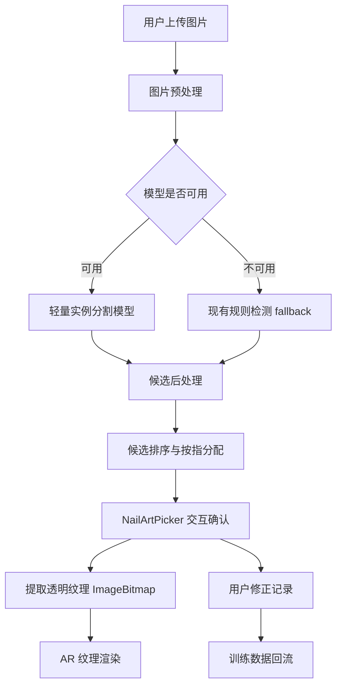

# 美甲纹理识别专用模型规划方案

版本: v1.0
日期: 2026-06-30
适用范围: 用户上传的美甲参考图、多指甲纹理贴图、局部手部特写图

## 1. 背景与目标

当前项目已经可以在用户上传参考图中定位美甲区域，并从参考图中提取 4 份或 5 份可用于 AR 试戴的 `ImageBitmap` 纹理。现有能力主要来自两类逻辑：

- `MediaPipe Hands + nail-geometry`: 适合完整手部图，依赖 21 个手部关键点。
- `nail-image-detection`: 适合裁剪美甲特写图，使用肤色上下文、纹理显著性和候选峰值聚类。

下一步要做的不是把现有规则继续堆厚，而是沉淀一个专门识别美甲纹理贴图的模型化系统。它需要能处理用户从网络、相册、样板图、商家图中上传的美甲图，并输出稳定的指甲实例区域、方向、置信度和可裁剪纹理。

### 1.1 核心目标

1. 输入一张用户上传图片，自动识别其中 1 到 10 个可用美甲区域。
2. 输出每个美甲区域的实例 mask、旋转框、中心、长宽、方向、置信度。
3. 自动提取透明背景的单枚指甲纹理贴图，兼容当前 AR 渲染。
4. 在浏览器本地完成推理，不把用户图片上传到服务器。
5. 保留手动微调入口，让模型结果可以被用户修正，同时把修正结果转化为后续训练数据。

### 1.2 非目标

- 第一阶段不做生成式美甲设计模型。
- 第一阶段不识别复杂款式语义，例如“法式”“猫眼”“渐变”的文本标签。
- 第一阶段不追求医学级或工业级精确分割，只要求满足 AR 纹理裁剪和视觉贴合。
- 第一阶段不把训练流程放到浏览器端；训练离线完成，浏览器只做推理。

## 2. 推荐路线

推荐路线是“规则检测做数据引导 + 轻量实例分割模型 + 浏览器本地推理”。

短期继续保留 `nail-image-detection.ts` 作为 baseline 和 fallback；中期用它生成候选框，人工快速修正形成数据集；长期训练一个轻量指甲实例分割模型，部署为 ONNX 或 TFLite，在浏览器端推理。

### 2.1 路线对比

| 路线 | 能力 | 优点 | 风险 | 结论 |
| --- | --- | --- | --- | --- |
| 规则检测增强 | 中心点、旋转框 | 已验证，零模型体积，速度快 | 泛化有限，复杂背景容易误检 | 保留为 fallback 和数据引导 |
| 目标检测模型 | bounding box | 标注成本低，速度快 | 不能精确裁掉背景和皮肤 | 可做 Phase 2 低成本版本 |
| 实例分割模型 | mask + box | 最适合纹理提取，边缘更干净 | 标注成本较高，浏览器后处理复杂 | 推荐主路线 |
| SAM/MobileSAM 微调 | 高质量 mask | 泛化强 | 模型大，浏览器端成本高 | 不作为主线，可做离线标注辅助 |
| MediaPipe Model Maker | 轻量对象检测 | 训练和 Web 集成路线清晰 | 更偏检测，不天然输出 mask | 适合作为备用检测模型 |

### 2.2 为什么推荐实例分割

美甲纹理贴图的最终产物不是“找到位置”这么简单，而是要裁出干净的甲面纹理。只用 box 会包含皮肤、边缘、背景或花瓣等干扰；实例 mask 可以更自然地：

- 去掉甲面外的皮肤和背景。
- 保留异形甲、圆甲、方甲、长甲的真实轮廓。
- 给 AR 渲染输出透明边缘纹理。
- 给用户预览更可信的候选结果。

实例分割模型建议从轻量 YOLO segmentation 路线开始。Ultralytics 官方文档支持自定义分割数据集训练和导出 ONNX；浏览器推理侧可用 ONNX Runtime Web，官方文档说明其支持 WASM、WebGL、WebGPU 和 WebNN execution provider。MediaPipe Model Maker 官方也支持用自有数据定制目标检测模型，可作为备用路线。

参考资料：

- Ultralytics segmentation: https://docs.ultralytics.com/tasks/segment/
- Ultralytics export: https://docs.ultralytics.com/modes/export/
- ONNX Runtime Web: https://onnxruntime.ai/docs/tutorials/web/
- ONNX Runtime WebGPU: https://onnxruntime.ai/docs/tutorials/web/ep-webgpu.html
- MediaPipe Model Maker object detector: https://developers.google.com/edge/mediapipe/solutions/customization/object_detector

## 3. 系统架构



### 3.1 推理管线

1. 读取上传图片，统一处理 EXIF 方向、alpha 通道和最大边长。
2. 将图片缩放到模型输入尺寸，例如 `640x640`，保持原图到模型输入的映射矩阵。
3. 模型输出每个实例的 mask、box、score。
4. 后处理过滤低置信度结果，合并重复候选，按甲面大小、长宽比、肤色邻域和内部纹理得分重新排序。
5. 将 mask/box 映射回原图坐标，生成 `NailTextureCandidate`。
6. 在 `NailArtPicker` 中显示候选，允许用户拖拽、旋转、删除、重新分配手指。
7. 点击完成后，用 mask 或贝塞尔甲形路径提取透明 `ImageBitmap`。

### 3.2 模型与规则的关系

模型不是直接替代现有规则，而是成为第一优先级：

1. 模型推理成功且候选质量足够：使用模型结果。
2. 模型不可用、加载失败、浏览器不支持所需后端：使用 `nail-image-detection.ts`。
3. 两者都低置信：进入手动添加选区。
4. 用户手动修正后的结果进入本地调试样本池，后续可导出为训练样本。

## 4. 数据规划

### 4.1 数据来源

初期数据建议分为四类：

| 类别 | 数量目标 | 用途 |
| --- | ---: | --- |
| 已验证参考图 | 50 到 100 张 | 快速建立种子集 |
| 网络公开美甲样板图 | 500 到 1000 张 | 提升图案和拍摄风格覆盖 |
| 用户授权测试图 | 200 到 500 张 | 贴近真实上传分布 |
| 负样本图 | 200 到 500 张 | 降低花瓣、饰品、皮肤纹理误检 |

注意：网络图片只能用于内部技术验证时，也要保留来源记录；如果用于训练或商业发布，需要确认授权和许可。用户上传图只有在用户明确授权后才进入训练集。

### 4.2 标注规范

主标注任务是实例分割：

- 类别只有一个：`nail_texture`。
- 每个可独立提取纹理的甲面标一个 polygon mask。
- 如果甲面被遮挡，但剩余区域仍可裁出可用纹理，则标可见部分。
- 指甲边缘高光属于甲面，保留。
- 手指皮肤、饰品、花瓣、背景不属于 mask。
- 如果图片里有成品甲片但不在手上，只要可作为纹理贴图，也标为 `nail_texture`。

附加属性建议：

| 字段 | 类型 | 说明 |
| --- | --- | --- |
| `finger_hint` | enum | `thumb/index/middle/ring/pinky/unknown` |
| `shape` | enum | `square/round/almond/coffin/stiletto/unknown` |
| `quality` | number | 1 到 5，纹理是否清晰可用 |
| `occluded` | boolean | 是否被遮挡 |
| `artificial_tip` | boolean | 是否是假甲片或样板甲 |

### 4.3 数据集目录

建议新增一个不进 Git 的数据工作区，例如 `model/datasets/nail-texture-v1/`：

```text
model/
  datasets/
    nail-texture-v1/
      images/
        train/
        val/
        test/
      labels-yolo-seg/
        train/
        val/
        test/
      metadata/
        sources.csv
        split.json
        label-audit.csv
  exports/
    nail-texture-seg-v1/
      model.onnx
      model.tflite
      labels.json
      metrics.json
```

`model/` 目录建议继续保持不纳入 Git，只提交训练脚本、配置、导出说明和小型测试样本。

### 4.4 数据切分

- `train`: 70%
- `val`: 15%
- `test`: 15%

切分必须按图片来源分组，避免同一套商家图的相似图片同时出现在训练集和测试集。测试集至少覆盖：

- 深色背景
- 浅色背景
- 花瓣、饰品、戒指干扰
- 红色、黑色、裸色、浅色甲
- 金线、高光、猫眼、亮片纹理
- 横图、竖图、近景、远景

## 5. 模型方案

### 5.1 MVP 模型

MVP 建议训练轻量实例分割模型：

- 输入尺寸：`640x640`
- 类别数：1
- 输出：box、mask prototype、mask coefficients、confidence
- 目标体积：ONNX 小于 15MB，理想小于 8MB
- 浏览器推理目标：中端手机 1.5 秒内完成单张图推理和后处理

候选路线：

1. `YOLO*-n-seg` 级别模型作为第一训练候选。
2. 若模型体积过大，转目标检测模型 + 当前贝塞尔甲形裁剪。
3. 若浏览器 ONNX 后处理成本过高，导出 TFLite 并尝试 MediaPipe Tasks 路线。

这里的 `*` 代表实际训练时选择当前可用的 Ultralytics 轻量版本，不在文档里绑定具体大版本，避免方案被模型命名变化卡住。

### 5.2 训练配置

建议初始训练参数：

```yaml
task: segment
classes:
  - nail_texture
imgsz: 640
epochs: 100
batch: auto
patience: 20
augment:
  hsv_h: 0.015
  hsv_s: 0.4
  hsv_v: 0.35
  degrees: 20
  translate: 0.08
  scale: 0.35
  fliplr: 0.5
  mosaic: 0.3
```

增强策略要克制。美甲纹理依赖颜色和细节，不能用过强的颜色扰动，否则会伤害模型对甲面与背景的区分。

### 5.3 指标

训练指标：

| 指标 | MVP 门槛 | 理想值 |
| --- | ---: | ---: |
| mask mAP50 | 0.75 | 0.85+ |
| box mAP50 | 0.85 | 0.92+ |
| 单图漏检率 | < 15% | < 8% |
| 单图误检率 | < 12% | < 6% |
| 平均中心误差 | < 35px | < 20px |
| 可用纹理提取率 | > 80% | > 92% |

产品指标：

- 用户上传参考图后，至少 80% 的真实美甲图能自动出现可用候选。
- 候选框需要用户大幅拖动的比例低于 20%。
- 点击“完成分配”后生成的纹理不含明显大面积皮肤或背景。
- 低置信图必须允许用户快速手动修正。

## 6. 后处理设计

模型输出不能直接交给 UI，需要做一层稳定化处理。

### 6.1 候选过滤

过滤规则：

- `score < 0.35` 的候选默认隐藏，但可在 debug 模式显示。
- mask 面积小于图片面积 `0.0008` 的候选删除。
- mask 面积大于图片面积 `0.08` 的候选删除，避免整根手指或背景被误检。
- 长宽比不在 `1.0 到 4.5` 的候选降权。
- 候选中心附近完全没有肤色上下文时降权，但不直接删除，因为独立甲片样板可能没有皮肤。

### 6.2 旋转框估计

从 mask 计算二阶矩或最小外接旋转矩形：

```ts
interface NailPose {
  cx: number;
  cy: number;
  length: number;
  width: number;
  angle: number;
}
```

如果 mask 是椭圆或近圆形，方向可能不稳定。此时使用以下顺序推断角度：

1. mask 主轴方向。
2. 附近肤色延展方向。
3. 图片中同组候选的平均方向。
4. 默认竖直方向。

### 6.3 候选排序与手指分配

对于美甲参考图，手指编号不能总是假定完整五指。因此需要分两层：

- `candidateIndex`: 按图中从左到右排序，稳定展示。
- `finger`: 默认推断，但允许用户修改。

默认规则：

- 5 个候选：映射为 `thumb/index/middle/ring/pinky`。
- 4 个候选：映射为 `index/middle/ring/pinky`。
- 1 到 3 个候选：不强行判断手指，默认分配到当前 active finger 或让用户选择。
- 如果 MediaPipe Hands 同时检测到完整手，则用手部关键点辅助映射。

## 7. 浏览器端部署

### 7.1 推理后端

优先级：

1. ONNX Runtime Web + WebGPU。
2. ONNX Runtime Web + WASM。
3. 规则检测 fallback。

ONNX Runtime Web 官方支持 WASM、WebGL、WebGPU 和 WebNN；WASM 覆盖算子更完整，WebGPU 更适合性能优化，但需要做兼容性探测。浏览器端初始化时只加载一次 session，后续复用。

### 7.2 模型加载策略

新增模型管理器：

```ts
interface NailTextureModelInfo {
  version: string;
  backend: "webgpu" | "wasm" | "fallback";
  inputSize: number;
  loadedAt: number;
}
```

加载策略：

- 用户第一次点击“多纹理提取”时懒加载模型。
- 加载过程显示短 loading，不阻塞整个 AR 页面。
- 模型加载失败时使用 `nail-image-detection.ts`。
- 模型文件使用 cache headers，让浏览器缓存。
- 模型版本写入 manifest，方便灰度和回滚。

### 7.3 Worker 化

推理、mask 后处理和纹理裁剪建议放到 Worker：

```text
src/workers/nail-texture-recognition.worker.ts
```

Worker 输入：

```ts
interface RecognizeNailTextureRequest {
  id: string;
  imageBitmap: ImageBitmap;
  maxCandidates: number;
  preferModel: boolean;
}
```

Worker 输出：

```ts
interface RecognizeNailTextureResponse {
  id: string;
  candidates: NailTextureCandidate[];
  backend: "model" | "fallback";
  elapsedMs: number;
  warnings: string[];
}
```

## 8. TypeScript 接口规划

建议新增公共类型文件：

```text
src/lib/nail-texture-recognition/types.ts
```

核心类型：

```ts
export interface NailTextureCandidate {
  id: string;
  cx: number;
  cy: number;
  length: number;
  width: number;
  angle: number;
  score: number;
  confidence: "high" | "medium" | "low";
  source: "model" | "mediapipe" | "saliency" | "manual";
  mask?: NailMask;
  suggestedFinger: number | null;
}

export interface NailMask {
  width: number;
  height: number;
  data: Uint8Array;
  originX: number;
  originY: number;
  scale: number;
}

export interface NailTextureRecognitionResult {
  candidates: NailTextureCandidate[];
  backend: "model" | "fallback";
  elapsedMs: number;
  modelVersion?: string;
  warnings: string[];
}
```

## 9. 代码结构规划

建议新增模块：

```text
src/lib/nail-texture-recognition/
  index.ts
  types.ts
  preprocess.ts
  postprocess.ts
  model-runtime.ts
  fallback-adapter.ts
  extract-mask-texture.ts
  quality.ts

src/workers/
  nail-texture-recognition.worker.ts

public/models/nail-texture-seg/
  manifest.json
  nail-texture-seg-v1.onnx
```

职责划分：

| 文件 | 职责 |
| --- | --- |
| `types.ts` | 公共类型和跨线程消息类型 |
| `preprocess.ts` | 图片缩放、归一化、输入 tensor 构建 |
| `model-runtime.ts` | ONNX session 初始化、后端选择、模型推理 |
| `postprocess.ts` | NMS、mask 解码、旋转框估计、排序 |
| `fallback-adapter.ts` | 把当前 `detectNailRegionsFromImageData()` 包装成统一结果 |
| `extract-mask-texture.ts` | 根据 mask 输出透明纹理 |
| `quality.ts` | 候选质量评分和低置信判断 |
| `index.ts` | 对 UI 暴露 `recognizeNailTextures()` |

现有文件改造：

| 文件 | 改造点 |
| --- | --- |
| `src/components/NailArtPicker.tsx` | 从直接调用 `detectNailRegionsFromImageData` 改为调用统一识别服务 |
| `src/lib/nail-image-detection.ts` | 保留，作为 fallback |
| `src/lib/texture.ts` | 扩展 mask 裁剪能力，或新增独立透明纹理裁剪函数 |
| `tests/nail-image-detection.test.ts` | 扩展为 model/fallback 共用验收 |
| `scripts/verify-nail-detection.ts` | 增加模型推理结果导出和 mask overlay |

## 10. 训练与导出脚本规划

建议新增：

```text
model/
  training/
    README.md
    dataset.yaml
    train-yolo-seg.py
    export-onnx.py
    evaluate.py
    convert-annotations.ts
    audit-labels.ts
```

训练流程：

1. 收集图片到 `model/datasets/nail-texture-v1/images/raw/`。
2. 使用标注工具输出 polygon mask。
3. `convert-annotations.ts` 转换为 YOLO segmentation 格式。
4. `audit-labels.ts` 检查空标注、超界 polygon、重复样本。
5. `train-yolo-seg.py` 训练。
6. `evaluate.py` 在 test split 上输出指标和可视化。
7. `export-onnx.py` 导出浏览器模型。
8. 将模型复制到 `public/models/nail-texture-seg/`，更新 manifest。

## 11. 用户修正数据回流

为了让模型越来越像产品自己的能力，而不是一次性训练后停住，需要把用户修正变成数据闭环。

### 11.1 本地调试记录

开发模式下，当用户手动调整候选后，可以导出：

```json
{
  "imageId": "local-debug-001",
  "modelVersion": "fallback-v0",
  "originalCandidates": [],
  "correctedCandidates": [],
  "createdAt": "2026-06-30T00:00:00.000Z"
}
```

生产环境默认不上传这些数据。只有用户明确同意参与改进计划时，才可以保存或上传样本。

### 11.2 主动学习优先级

优先回收这些样本：

- 模型低置信但用户成功修正。
- 模型高置信但用户删除。
- 用户大幅移动或缩放候选。
- 规则 fallback 成功但模型失败。
- 背景复杂、饰品多、图案强反光的图片。

## 12. 实施路线图

### Phase 0: 现状固化

目标：把当前可用规则检测固化为 baseline。

任务：

- 统一 `NailTextureCandidate` 类型。
- 把 `nail-image-detection.ts` 包装成 `fallback-adapter.ts`。
- 将参考图绿圈真值测试升级为通用 fixture 机制。
- 修复文档和源码中的编码显示问题，降低后续维护成本。

验收：

- 当前参考图继续检测 4 个候选。
- `npm.cmd test`、`npm.cmd run lint`、`npm.cmd run build` 通过。
- `NailArtPicker` 仍能完成多纹理提取。

### Phase 1: 数据与标注工具链

目标：建立第一版可训练数据集。

任务：

- 定义标注规范。
- 收集 200 张种子图。
- 用当前 fallback 自动生成候选，人工修正为 mask。
- 完成 `convert-annotations.ts` 和 `audit-labels.ts`。
- 建立 train/val/test split。

验收：

- 至少 800 个有效 nail mask。
- label audit 通过率 100%。
- test split 中包含负样本和复杂背景样本。

### Phase 2: 第一版模型

目标：训练可替代大部分规则检测的轻量模型。

任务：

- 训练轻量 segmentation 模型。
- 输出 `metrics.json`、混淆样本、失败样本可视化。
- 导出 ONNX。
- 写 Node 端验证脚本，对固定样本集跑推理。

验收：

- mask mAP50 >= 0.75。
- 测试集可用纹理提取率 >= 80%。
- ONNX 模型小于 15MB。

### Phase 3: 浏览器集成

目标：模型在浏览器本地可用。

任务：

- 增加 `onnxruntime-web` 依赖。
- 实现模型 manifest 和懒加载。
- 实现 Worker 推理。
- 实现模型结果到 `NailArtPicker` 候选的映射。
- 保留 fallback。

验收：

- 桌面浏览器单图总耗时 < 800ms。
- 中端手机单图总耗时 < 1500ms。
- 模型加载失败时 fallback 正常。
- UI 不阻塞，用户可取消。

### Phase 4: 质量优化

目标：让提取出来的纹理更像真实可贴图资产。

任务：

- mask 边缘羽化。
- 高光区域保护或轻微修复。
- 透明背景输出。
- 低质量候选提示。
- 候选方向稳定化。

验收：

- 用户无需调整即可直接使用的样本比例 > 85%。
- 纹理中明显皮肤/背景污染比例 < 10%。
- 异形甲、圆甲、长甲不被统一裁成粗糙矩形。

### Phase 5: 数据闭环与版本管理

目标：形成持续改进能力。

任务：

- 增加模型版本 manifest。
- 增加 debug 样本导出。
- 增加模型 A/B 对比脚本。
- 建立失败样本分类表。

验收：

- 每次模型更新都有指标对比。
- 可回滚到上一个模型版本。
- 失败样本能被归类到数据、模型、后处理或 UI 问题。

## 13. 风险与应对

| 风险 | 影响 | 应对 |
| --- | --- | --- |
| 标注成本高 | 模型进度慢 | 用现有规则生成候选，人工修正，而不是从零标 |
| 浏览器模型太大 | 首次加载慢 | 先用 nano 级模型，必要时退到检测模型 |
| mask 后处理复杂 | UI 集成慢 | Phase 2 先输出旋转框，Phase 4 再启用 mask 裁剪 |
| 网络图片授权不清 | 训练数据不可发布 | 记录来源，只用授权数据训练正式模型 |
| 强反光和金线误判 | 漏检或边缘不稳 | 数据集中专门增加高光、亮片、金线样本 |
| 独立甲片没有皮肤上下文 | fallback 降权 | 模型路线不依赖肤色；后处理只降权不删除 |
| 用户上传非美甲图 | 误检 | 负样本训练 + 低置信友好提示 |
| Safari/Firefox 推理慢 | 体验差 | WASM fallback + 加载进度 + 手动模式 |

## 14. 验收清单

MVP 完成必须满足：

- 有 200 张以上训练图片和独立 test split。
- 有可复现训练脚本和导出脚本。
- 有一个可在浏览器加载的模型文件。
- `NailArtPicker` 可以从模型结果显示候选。
- 模型失败时现有 fallback 继续可用。
- 参考图流程继续通过：上传图 -> 自动候选 -> 完成分配 -> 食指/中指/无名指/小指生成纹理。
- `npm.cmd test`、`npm.cmd run lint`、`npm.cmd run build` 通过。

## 15. 第一批任务建议

第一批建议做这些，不急着直接训练：

1. 把当前识别输出类型统一为 `NailTextureCandidate`。
2. 修复 `NailArtPicker.tsx` 和 `texture.ts` 中的历史编码显示问题。
3. 建立 `model/datasets/nail-texture-v1` 目录规范和 README。
4. 选 50 张美甲参考图，用当前 fallback 生成候选 overlay。
5. 人工修正这 50 张，先验证 mask 标注规范是否顺手。
6. 再扩到 200 张，开始训练第一版轻量 segmentation 模型。

这套节奏的好处是：每一步都会产出可用资产。即使第一版模型效果一般，当前规则检测仍然能继续服务产品；而用户修正和标注数据会逐步把系统带到真正的专用模型能力。
